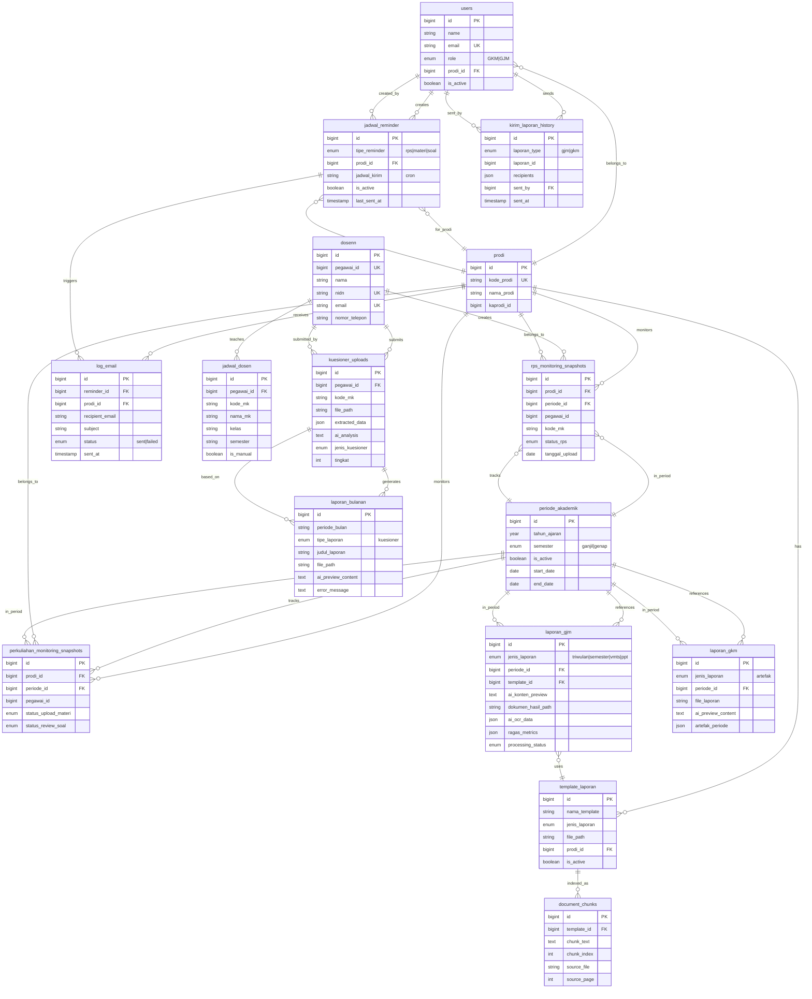

# ENTITY RELATIONSHIP DIAGRAM (ERD)
## Sistem Monitoring dan Pelaporan Akademik PA3

---

## 🎯 OVERVIEW

Sistem ini terdiri dari 4 subsistem utama:
1. **Core System** - User, Prodi, Periode
2. **Monitoring System (GKM)** - RPS, Perkuliahan, Kuesioner
3. **Reporting System (GJM)** - Laporan Triwulan, Semester, VMTS
4. **AI & Support System** - RAG, Cache, Notifications

---

## 📊 FULL SYSTEM ERD



---

## 🔍 DETAILED SUBSYSTEM ERDs

### 1. CORE SYSTEM

```
┌─────────────────┐
│     USERS       │
│ - id (PK)       │
│ - email (UK)    │
│ - role (ENUM)   │──┐
│ - prodi_id (FK) │  │
│ - is_active     │  │
└─────────────────┘  │
         │           │
         │ 1         │ 1
         │           │
         │ N         │ N
         ↓           ↓
┌─────────────────┐ ┌──────────────────┐
│ JADWAL_REMINDER │ │      PRODI       │
│ - id (PK)       │ │ - id (PK)        │
│ - user_id (FK)  │←│ - kode_prodi(UK) │
│ - prodi_id (FK) │ │ - nama_prodi     │
└─────────────────┘ │ - kaprodi_id     │
                    └──────────────────┘
```

### 2. MONITORING SYSTEM (GKM)

```
┌──────────────────────┐
│  PERIODE_AKADEMIK    │
│  - id (PK)           │
│  - tahun_ajaran      │
│  - semester          │──┐
│  - is_active         │  │
└──────────────────────┘  │
           │              │
           │ 1            │ 1
           │              │
           │ N            │ N
           ↓              ↓
┌──────────────────────────┐  ┌───────────────────────────────┐
│ RPS_MONITORING_SNAPSHOTS │  │ PERKULIAHAN_MONITORING_...   │
│ - id (PK)                │  │ - id (PK)                     │
│ - prodi_id (FK)          │  │ - prodi_id (FK)               │
│ - periode_id (FK)        │  │ - periode_id (FK)             │
│ - pegawai_id             │  │ - pegawai_id                  │
│ - kode_mk                │  │ - status_upload_materi        │
│ - status_rps             │  │ - status_review_soal          │
│ - tanggal_upload         │  │                               │
└──────────────────────────┘  └───────────────────────────────┘
           ↑                              ↑
           │ N                            │ N
           │                              │
           │ 1                            │ 1
       ┌─────────┐
       │ DOSENN  │ (From External API)
       │- id (PK)│
       │- pegawai│
       │- nidn   │
       └─────────┘
           │
           │ 1
           │
           │ N
           ↓
    ┌──────────────────┐
    │ JADWAL_DOSEN     │
    │ - id (PK)        │
    │ - pegawai_id(FK) │
    │ - kode_mk        │
    │ - nama_mk        │
    └──────────────────┘
```

### 3. KUESIONER SYSTEM

```
┌─────────┐
│ DOSENN  │
│- pegawai│
└─────────┘
     │ 1
     │
     │ N
     ↓
┌─────────────────────┐
│ KUESIONER_UPLOADS   │
│ - id (PK)           │
│ - pegawai_id (FK)   │
│ - file_path         │
│ - extracted_data    │ ← OCR Result
│ - ai_analysis       │ ← AI Processing
│ - statistik_*       │ ← Computed Stats
└─────────────────────┘
     │ 1
     │
     │ N
     ↓
┌─────────────────────┐
│ LAPORAN_BULANAN     │
│ - id (PK)           │
│ - periode_bulan     │
│ - tipe_laporan      │
│ - ai_preview_content│ ← AI Generated
│ - file_path         │
└─────────────────────┘
```

### 4. REPORTING SYSTEM (GJM)

```
┌──────────────────┐
│ PERIODE_AKADEMIK │
│ - id (PK)        │
└──────────────────┘
         │ 1
         │
         │ N
         ↓
┌─────────────────────┐       ┌──────────────────┐
│   LAPORAN_GJM       │   N   │ TEMPLATE_LAPORAN │
│ - id (PK)           │←──────│ - id (PK)        │
│ - jenis_laporan     │   1   │ - nama_template  │
│   * triwulan        │       │ - jenis_laporan  │
│   * semester        │       │ - file_path      │
│   * vmts            │       │ - prodi_id (FK)  │
│   * ppt             │       │ - is_active      │
│ - periode_id (FK)   │       └──────────────────┘
│ - template_id (FK)  │                │ 1
│ - ai_konten_preview │                │
│ - dokumen_hasil_path│                │ N
│ - ai_ocr_data (JSON)│                ↓
│ - ragas_metrics     │       ┌──────────────────┐
│ - processing_status │       │ DOCUMENT_CHUNKS  │
└─────────────────────┘       │ - id (PK)        │
                              │ - template_id(FK)│
                              │ - chunk_text     │ ← For RAG
                              │ - chunk_index    │
                              └──────────────────┘
```

### 5. NOTIFICATION SYSTEM

```
┌─────────────────┐       ┌─────────┐
│ JADWAL_REMINDER │   N   │  PRODI  │
│ - id (PK)       │───────│- id (PK)│
│ - prodi_id (FK) │   1   └─────────┘
│ - tipe_reminder │
│   * rps         │
│   * materi      │
│   * soal        │
│ - jadwal_kirim  │ (cron expression)
│ - is_active     │
│ - last_sent_at  │
└─────────────────┘
         │ 1
         │
         │ N
         ↓
┌─────────────────────┐
│    LOG_EMAIL        │
│ - id (PK)           │
│ - reminder_id (FK)  │
│ - prodi_id (FK)     │
│ - recipient_email   │
│ - subject           │
│ - status            │
│ - sent_at           │
└─────────────────────┘
```

---

## 🗄️ MONGODB COLLECTIONS

### ai_response_cache_mongo

```json
{
  "_id": ObjectId,
  "cache_key": "hash_string",
  "prompt_hash": "hash_string",
  "original_prompt": "text",
  "context_metadata": {
    "prodi": "IF",
    "periode": "2024/2025 Ganjil"
  },
  "ai_response": "long text",
  "ai_provider": "groq|openai|claude",
  "ai_model": "llama3|gpt-4|claude-3",
  "usage_count": 5,
  "last_used_at": ISODate,
  "response_length": 1234,
  "similarity_threshold": 0.85,
  "created_at": ISODate,
  "updated_at": ISODate
}
```

### hasil_analisis_mongo

```json
{
  "_id": ObjectId,
  "kuesioner_upload_id": 123,
  "periode": "2024/2025 Ganjil",
  "prodi": "Teknik Informatika",
  "statistik": {
    "total_responden": 45,
    "nilai_rata_rata": 4.2,
    "tingkat_kepuasan": "Sangat Baik"
  },
  "ai_summary": "Hasil analisis menunjukkan...",
  "strengths": ["...", "..."],
  "improvements": ["...", "..."],
  "created_at": ISODate,
  "updated_at": ISODate
}
```

---

## 🔗 RELATIONSHIP SUMMARY

### One-to-Many Relationships

| Parent | Child | Foreign Key | Cascade |
|--------|-------|-------------|---------|
| users | jadwal_reminder | user_id | CASCADE |
| prodi | users | prodi_id | RESTRICT |
| prodi | template_laporan | prodi_id | CASCADE |
| prodi | rps_monitoring_snapshots | prodi_id | CASCADE |
| prodi | perkuliahan_monitoring_snapshots | prodi_id | CASCADE |
| periode_akademik | laporan_gjm | periode_id | RESTRICT |
| periode_akademik | laporan_gkm | periode_id | RESTRICT |
| template_laporan | document_chunks | template_id | CASCADE |
| template_laporan | laporan_gjm | template_id | RESTRICT |
| dosenn | jadwal_dosen | pegawai_id | CASCADE |
| dosenn | kuesioner_uploads | pegawai_id | RESTRICT |
| kuesioner_uploads | laporan_bulanan | kuesioner_id | RESTRICT |
| jadwal_reminder | log_email | reminder_id | CASCADE |

### Many-to-Many Relationships

Saat ini tidak ada relasi many-to-many yang aktif digunakan.

**Deprecated:**
- dosen_matakuliah (dropped)
- matkul_dosen (dropped)

---

## 📈 DATA FLOW DIAGRAM

### Flow 1: Monitoring RPS
```
API Eksternal (Feeder)
         │
         ↓
  Sync Job (SyncJadwalDosenJob)
         │
         ↓
   jadwal_dosen (MySQL)
         │
         ↓
  MonitoringRPSController
         │
         ↓
rps_monitoring_snapshots (MySQL)
         │
         ↓
  Dashboard GKM (Display)
```

### Flow 2: Generate Laporan GJM (Triwulan)

```
User Upload Images/Files (OCR)
         │
         ↓
   OCRUploadController
         │
         ├─→ OCR Service (Extract Text)
         │
         ├─→ AI Service (Analyze & Generate)
         │        │
         │        ↓
         │   ai_response_cache_mongo
         │
         ↓
  template_laporan (MySQL)
         │
         ↓
  document_chunks (For RAG Context)
         │
         ↓
  VectorDatabaseService (Search Relevant)
         │
         ↓
  LaporanTriwulanService (Generate Document)
         │
         ↓
   laporan_gjm (MySQL - Save Record)
         │
         ↓
  GenerateLaporanSemesterJob (Queue)
         │
         ↓
  Word Document Generated
```

### Flow 3: Kuesioner Analysis

```
Upload Kuesioner (Scan/Image)
         │
         ↓
  MonitoringKuesioneController
         │
         ├─→ OCR Service (Extract Answers)
         │
         ├─→ AI Service (Analyze Sentiment)
         │
         ↓
  kuesioner_uploads (MySQL)
         │
         ├─→ extracted_data (JSON)
         └─→ ai_analysis (Text)
         │
         ↓
  hasil_analisis_mongo (MongoDB)
         │
         ├─→ statistik
         └─→ ai_summary
         │
         ↓
  LaporanKuesioneService
         │
         ↓
  laporan_bulanan (MySQL)
         │
         ↓
  Word/PDF Document
```

---

## 🎨 COLOR CODING (for Visual ERD Tools)

Jika Anda menggunakan tools seperti dbdiagram.io atau draw.io:

- **🔵 Blue** - Core Tables (users, prodi, periode_akademik)
- **🟢 Green** - Monitoring Tables (snapshots, jadwal_dosen)
- **🟡 Yellow** - Reporting Tables (laporan_gjm, laporan_gkm, laporan_bulanan)
- **🟣 Purple** - AI/ML Tables (document_chunks, embeddings_cache)
- **🟠 Orange** - Notification Tables (jadwal_reminder, log_email)
- **⚫ Gray** - Support Tables (cache, jobs)
- **🔴 Red** - External API Models (dosenn)

---

## 📝 NOTES

1. **Foreign Key Constraints:**
   - Kebanyakan menggunakan RESTRICT untuk mencegah deletion cascade yang tidak diinginkan
   - CASCADE hanya untuk truly dependent data (log_email → reminder)

2. **Soft Deletes:**
   - Tidak ada soft deletes (deleted_at) di tabel aktif
   - Pertimbangkan menambahkan untuk audit trail

3. **Indexes:**
   - Semua FK sudah ter-index otomatis
   - Perlu tambahan index untuk: 
     - kuesioner_uploads.pegawai_id + periode
     - laporan_gjm.jenis_laporan + periode_id
     - rps_monitoring_snapshots.prodi_id + periode_id

4. **Data Archiving:**
   - Belum ada strategi archiving untuk data lama
   - Pertimbangkan partition by year untuk tabel monitoring

---

**End of ERD Documentation**
