# Entity Relationship Diagram (ERD)
## Sistem Monitoring Mutu Akademik

Diagram ini menggambarkan struktur database lengkap dari sistem monitoring mutu akademik yang telah dibangun.

```mermaid
erDiagram
    %% Entitas Utama
    PRODI ||--o{ USERS : "memiliki"
    PRODI ||--o{ DOSEN : "memiliki"
    PRODI ||--o{ MATAKULIAH : "memiliki"
    PRODI ||--o{ LAPORAN_GKM : "membuat"
    PRODI ||--o{ MONITORING : "dimonitor"
    PRODI ||--o{ PENCAPAIAN_KPI : "memiliki"
    PRODI ||--o{ KELAS : "memiliki"
    PRODI ||--o{ TEMPLATE_LAPORAN : "memiliki"
    PRODI ||--o{ LAPORAN_BULANAN : "membuat"
    PRODI ||--o{ JADWAL_REMINDER : "memiliki"
    
    USERS ||--o| DOSEN : "adalah"
    USERS ||--o{ LAPORAN_GJM : "review"
    USERS ||--o{ TEMPLATE_LAPORAN : "upload"
    USERS ||--o{ LAPORAN_BULANAN : "buat"
    
    DOSEN ||--o{ RPS : "membuat"
    DOSEN ||--o{ EVALUASI_ARTEFAK : "evaluasi"
    DOSEN ||--o{ REMINDER : "menerima"
    DOSEN ||--o{ PERWALIAAN : "melakukan"
    DOSEN ||--o{ JAWABAN_KUISIONER : "menjawab"
    DOSEN ||--o{ LAPORAN_GKM : "ketua"
    DOSEN ||--o{ LAPORAN_GKM : "review"
    DOSEN }o--o{ MATAKULIAH : "mengajar"
    
    MATAKULIAH ||--o{ RPS : "memiliki"
    MATAKULIAH }o--o{ DOSEN : "diajar_oleh"
    
    AJARAN ||--o{ RPS : "periode"
    AJARAN ||--o{ KUISIONER : "periode"
    AJARAN ||--o{ LAPORAN_GKM : "periode"
    AJARAN ||--o{ LAPORAN_GJM : "periode"
    AJARAN ||--o{ PERWALIAAN : "periode"
    AJARAN ||--o{ MONITORING : "periode"
    AJARAN ||--o{ PENCAPAIAN_KPI : "periode"
    
    RPS ||--o{ MATERI : "memiliki"
    RPS ||--o{ EVALUASI_ARTEFAK : "dievaluasi"
    
    MATERI ||--o{ EVALUASI_ARTEFAK : "dievaluasi"
    
    KUISIONER ||--o{ PERTANYAAN_KUISIONER : "memiliki"
    
    PERTANYAAN_KUISIONER ||--o{ JAWABAN_KUISIONER : "dijawab"
    
    REMINDER ||--o{ LOG_EMAIL : "menghasilkan"
    
    KUESIONER_UPLOADS ||--o{ DOCUMENT_CHUNKS : "dipecah"
    KUESIONER_UPLOADS ||--o{ LAPORAN_BULANAN : "digunakan"
    
    TEMPLATE_LAPORAN ||--o{ DOCUMENT_CHUNKS : "dipecah"
    TEMPLATE_LAPORAN ||--o{ LAPORAN_BULANAN : "digunakan"
    
    %% Definisi Entitas
    PRODI {
        bigint id PK
        string kode_prodi UK
        string nama_prodi
        string nama_singkat
        text deskripsi
        bigint kaprodi_id FK
        timestamp created_at
        timestamp updated_at
    }
    
    USERS {
        bigint id PK
        string name
        string email UK
        string username UK
        string password
        enum role
        bigint prodi_id FK
        boolean is_active
        timestamp email_verified_at
        string remember_token
        timestamp created_at
        timestamp updated_at
    }
    
    DOSEN {
        bigint id PK
        bigint user_id FK
        string nama_lengkap
        string nidn UK
        string gelar_akademik
        string jabatan_akademik
        string kontak_email
        bigint prodi_id FK
        text bio
        string foto_profil
        enum status
        boolean is_kaprodi
        boolean is_wali_kelas
        timestamp created_at
        timestamp updated_at
    }
    
    MATAKULIAH {
        bigint id PK
        bigint prodi_id FK
        string kode_mk UK
        string nama_mk
        int sks
        int semester
        string jenis_mk
        text deskripsi
        text capaian_pembelajaran
        enum status
        timestamp created_at
        timestamp updated_at
    }
    
    DOSEN_MATAKULIAH {
        bigint id PK
        bigint dosen_id FK
        bigint matakuliah_id FK
        timestamp created_at
        timestamp updated_at
    }
    
    AJARAN {
        bigint id PK
        year tahun_ajaran
        enum semester
        date tanggal_mulai
        date tanggal_akhir
        enum status
        bigint prodi_id FK
        timestamp created_at
        timestamp updated_at
    }
    
    RPS {
        bigint id PK
        bigint matakuliah_id FK
        bigint ajaran_id FK
        bigint dosen_id FK
        text deskripsi
        text capaian_pembelajaran
        text strategi_pembelajaran
        text penugasan
        text penilaian
        string file_rps
        enum status_rps
        enum status_review_rps
        date tanggal_upload
        date tanggal_validasi
        text catatan_validasi
        timestamp created_at
        timestamp updated_at
    }
    
    MATERI {
        bigint id PK
        bigint rps_id FK
        string judul_materi
        text deskripsi
        int pertemuan_ke
        string file_materi
        string file_format
        text capaian_pembelajaran
        date tanggal_upload
        enum status
        enum status_upload_materi
        text catatan
        timestamp created_at
        timestamp updated_at
    }
    
    MONITORING {
        bigint id PK
        bigint ajaran_id FK
        bigint prodi_id FK
        enum jenis_monitoring
        int total_dosen
        int dosen_selesai
        int dosen_belum
        decimal persentase_kepatuhan
        date tanggal_monitoring
        text catatan
        timestamp created_at
        timestamp updated_at
    }
    
    REMINDER {
        bigint id PK
        bigint dosen_id FK
        bigint kaprodi_id FK
        enum tipe_reminder
        string judul
        text deskripsi
        date tanggal_reminder
        time waktu_reminder
        enum status
        enum status_pengiriman
        date tanggal_kirim
        string metode_pengiriman
        timestamp created_at
        timestamp updated_at
    }
    
    JADWAL_REMINDER {
        bigint id PK
        bigint prodi_id FK
        enum tipe_reminder
        int hari_sebelum_deadline
        enum frekuensi
        time waktu_pengiriman
        text template_pesan
        enum status
        text catatan
        string target_role
        date tanggal_mulai
        date tanggal_akhir
        timestamp last_sent_at
        timestamp created_at
        timestamp updated_at
    }
    
    LOG_EMAIL {
        bigint id PK
        bigint reminder_id FK
        bigint prodi_id FK
        string penerima_email
        string subjek
        text isi_email
        enum status_pengiriman
        text pesan_error
        date tanggal_pengiriman
        int percobaan_kirim
        timestamp created_at
        timestamp updated_at
    }
    
    LAPORAN_GKM {
        bigint id PK
        bigint prodi_id FK
        bigint ajaran_id FK
        bigint dosen_ketua FK
        date periode_mulai
        date periode_akhir
        enum jenis_laporan
        text ringkasan_temuan
        text hasil_monitoring_rps
        text hasil_monitoring_materi
        text hasil_monitoring_kuisioner
        text rencana_perbaikan
        string file_laporan
        enum status_laporan
        date tanggal_submit
        date tanggal_buat_laporan
        bigint reviewed_by FK
        date tanggal_review
        text catatan_review
        timestamp created_at
        timestamp updated_at
    }
    
    LAPORAN_GJM {
        bigint id PK
        bigint ajaran_id FK
        date periode_mulai
        date periode_akhir
        enum jenis_laporan
        text ringkasan_mutu_institusi
        text analisis_kepatuhan
        text temuan_utama
        text rekomendasi_perbaikan
        text rencana_tindakan
        string file_laporan
        string file_ppt
        enum status_laporan
        date tanggal_submit
        bigint reviewed_by FK
        date tanggal_review
        text catatan_review
        int jumlah_prodi_terlibat
        int jumlah_laporan_gkm_diterima
        timestamp created_at
        timestamp updated_at
    }
    
    KUISIONER {
        bigint id PK
        bigint ajaran_id FK
        string judul
        text deskripsi
        enum target
        date tanggal_mulai
        date tanggal_akhir
        enum status
        enum status_kuisioner
        timestamp created_at
        timestamp updated_at
    }
    
    PERTANYAAN_KUISIONER {
        bigint id PK
        bigint kuisioner_id FK
        int urutan_pertanyaan
        text pertanyaan
        enum tipe_pertanyaan
        text opsi_jawaban
        timestamp created_at
        timestamp updated_at
    }
    
    JAWABAN_KUISIONER {
        bigint id PK
        bigint pertanyaan_kuisioner_id FK
        bigint dosen_id FK
        string responden_identifier
        text jawaban
        date tanggal_jawab
        timestamp created_at
        timestamp updated_at
    }
    
    EVALUASI_ARTEFAK {
        bigint id PK
        bigint rps_id FK
        bigint materi_id FK
        bigint evaluator_id FK
        enum jenis_artefak
        int skor_evaluasi
        text catatan_evaluasi
        enum status_evaluasi
        date tanggal_evaluasi
        text saran_perbaikan
        date tanggal_revisi_selesai
        int jumlah_revisi
        timestamp created_at
        timestamp updated_at
    }
    
    PERWALIAAN {
        bigint id PK
        bigint dosen_id FK
        bigint ajaran_id FK
        int jumlah_mahasiswa
        date tanggal_mulai_perwalian
        date tanggal_akhir_perwalian
        enum status_perwalian
        int jumlah_sesi_konsultasi
        text catatan_perwalian
        decimal nilai_evaluasi
        timestamp created_at
        timestamp updated_at
    }
    
    PENCAPAIAN_KPI {
        bigint id PK
        bigint prodi_id FK
        bigint ajaran_id FK
        string nama_kpi
        text deskripsi
        decimal target_nilai
        decimal nilai_realisasi
        decimal persentase_pencapaian
        enum status_kpi
        text catatan_kpi
        timestamp created_at
        timestamp updated_at
    }
    
    KELAS {
        bigint id PK
        bigint prodi_id FK
        string kode_kelas
        int tingkat
        string program_studi
        int tahun_angkatan
        enum status
        timestamp created_at
        timestamp updated_at
    }
    
    KUESIONER_UPLOADS {
        bigint id PK
        string nama_file
        string file_path
        string periode
        bigint prodi_id FK
        string kode_matakuliah
        string nama_matakuliah
        int tingkat
        text deskripsi
        int total_responden
        json hasil_analisis
        enum status
        timestamp created_at
        timestamp updated_at
    }
    
    DOCUMENT_CHUNKS {
        bigint id PK
        bigint kuesioner_upload_id FK
        bigint template_id FK
        text chunk_text
        int chunk_index
        json embedding
        json metadata
        timestamp created_at
        timestamp updated_at
    }
    
    EMBEDDINGS_CACHE {
        bigint id PK
        string text_hash UK
        json embedding
        string model
        timestamp created_at
        timestamp updated_at
    }
    
    TEMPLATE_LAPORAN {
        bigint id PK
        bigint prodi_id FK
        string nama_template
        string nama_file
        string jenis_file
        string file_path
        int ukuran_file
        text deskripsi
        json structure_data
        boolean is_indexed
        bigint uploaded_by FK
        timestamp created_at
        timestamp updated_at
    }
    
    LAPORAN_BULANAN {
        bigint id PK
        string periode
        string bulan
        int tahun
        bigint prodi_id FK
        bigint user_id FK
        bigint template_id FK
        int total_kuesioner
        int total_responden
        decimal index_kepuasan_rata_rata
        decimal persen_kepuasan_rata_rata
        json hasil_laporan
        json data_kuesioner
        json data_analisis
        string file_word
        string file_pdf
        enum status
        text error_message
        timestamp created_at
        timestamp updated_at
    }
    
    JOBS {
        bigint id PK
        string queue
        text payload
        int attempts
        int reserved_at
        int available_at
        int created_at
    }
    
    FAILED_JOBS {
        bigint id PK
        string uuid UK
        text connection
        text queue
        text payload
        text exception
        timestamp failed_at
    }
```



## Penjelasan Relasi Utama

### 1. Modul Akademik Dasar
- **PRODI** sebagai entitas pusat yang menghubungkan semua data akademik
- **USERS** terhubung dengan **DOSEN** (one-to-one)
- **DOSEN** dan **MATAKULIAH** memiliki relasi many-to-many melalui **DOSEN_MATAKULIAH**

### 2. Modul RPS dan Materi
- **RPS** terkait dengan **MATAKULIAH**, **AJARAN**, dan **DOSEN**
- **MATERI** terkait dengan **RPS** (one-to-many)
- **EVALUASI_ARTEFAK** untuk evaluasi **RPS** dan **MATERI**

### 3. Modul Kuisioner
- **KUISIONER** memiliki **PERTANYAAN_KUISIONER** (one-to-many)
- **PERTANYAAN_KUISIONER** memiliki **JAWABAN_KUISIONER** (one-to-many)
- **KUESIONER_UPLOADS** untuk upload file kuisioner dengan AI processing

### 4. Modul Reminder
- **JADWAL_REMINDER** sebagai template jadwal pengiriman
- **REMINDER** sebagai instance reminder yang dikirim
- **LOG_EMAIL** mencatat history pengiriman email

### 5. Modul Laporan
- **LAPORAN_GKM** untuk laporan tingkat prodi
- **LAPORAN_GJM** untuk laporan tingkat institusi
- **LAPORAN_BULANAN** untuk laporan otomatis bulanan dengan AI
- **TEMPLATE_LAPORAN** sebagai template dokumen laporan

### 6. Modul AI & RAG
- **DOCUMENT_CHUNKS** menyimpan potongan dokumen untuk RAG
- **EMBEDDINGS_CACHE** cache vector embeddings
- Terhubung dengan **KUESIONER_UPLOADS** dan **TEMPLATE_LAPORAN**

### 7. Modul Monitoring
- **MONITORING** untuk tracking kepatuhan dosen
- **PENCAPAIAN_KPI** untuk tracking KPI prodi
- **PERWALIAAN** untuk tracking kegiatan perwalian

## Catatan Teknis

### Enum Values
- **role**: admin, kaprodi, dosen, gjm_reviewer, gkm_reviewer
- **status**: aktif, tidak_aktif, pensiun, draft, approved, dll
- **tipe_reminder**: rps_review, materi_upload, perwaliaan, persiapan_kuliah, review_soal, kuisioner
- **jenis_laporan**: bulanan, semester, tahunan

### Indexes
- Primary keys pada semua tabel
- Foreign keys dengan cascade/set null sesuai kebutuhan
- Unique constraints pada kombinasi tertentu (periode + prodi_id, dosen_id + matakuliah_id)
- Index pada kolom yang sering diquery (prodi_id, status, periode, dll)

### JSON Fields
- **hasil_analisis**: Hasil analisis AI pada kuisioner
- **embedding**: Vector embeddings untuk RAG
- **metadata**: Metadata tambahan untuk chunks
- **hasil_laporan**: Hasil generate laporan
- **structure_data**: Struktur dokumen template

## Diagram Relasi Sederhana

```
PRODI
  ├── USERS (Kaprodi, Dosen, Admin)
  ├── DOSEN
  │   ├── RPS → MATERI
  │   ├── PERWALIAAN
  │   └── REMINDER
  ├── MATAKULIAH
  ├── LAPORAN_GKM
  ├── MONITORING
  ├── KELAS
  └── TEMPLATE_LAPORAN

AJARAN (Periode Akademik)
  ├── RPS
  ├── KUISIONER
  ├── LAPORAN_GKM
  └── LAPORAN_GJM

AI & RAG System
  ├── KUESIONER_UPLOADS → DOCUMENT_CHUNKS
  ├── TEMPLATE_LAPORAN → DOCUMENT_CHUNKS
  ├── EMBEDDINGS_CACHE
  └── LAPORAN_BULANAN
```
