# CLASS DIAGRAM DOCUMENTATION - PA3 KEL06 2026
# SISTEM PENJAMINAN MUTU AKADEMIK (GKM & GJM)

**Versi:** 1.0  
**Tanggal:** 15 Juni 2026  
**Tim:** Kelompok 06  

---

## DAFTAR ISI

1. [Executive Summary](#executive-summary)
2. [Arsitektur Sistem](#arsitektur-sistem)
3. [Domain Models](#domain-models)
4. [Service Layer](#service-layer)
5. [Controller Layer](#controller-layer)
6. [Background Jobs](#background-jobs)
7. [External Integrations](#external-integrations)
8. [Diagram UML](#diagram-uml)

---

## EXECUTIVE SUMMARY

Sistem ini adalah **Quality Assurance Management System** berbasis Laravel yang mengintegrasikan:

- **RAG (Retrieval Augmented Generation)** untuk analisis cerdas
- **RAGAS Evaluation** untuk quality metrics
- **Multi-provider AI** (Groq, Claude, Gemini, OpenRouter)
- **Vector Database** untuk semantic search
- **OCR Processing** untuk ekstraksi dokumen
- **External API** (Library CIS DEL, WhatsApp)

### Modul Utama
1. **GKM (Gugus Kendali Mutu)**: Quality assurance tingkat program studi
2. **GJM (Gugus Jaminan Mutu)**: Quality assurance tingkat institusi
3. **AI Assistant**: Automated report generation dengan RAG

---

## CATATAN PENTING

### Komponen Tidak Aktif

#### N8N Workflow Automation
File-file terkait N8N masih ada dalam kode namun **TIDAK AKTIF** digunakan dalam sistem:

**File yang ada tapi tidak digunakan:**
- `app/Services/N8nService.php` - Service untuk integrasi N8N
- `app/Http/Controllers/API/N8nCallbackController.php` - Callback handler
- Route: `POST /api/n8n/callback` - Webhook endpoint

**Alasan:**
Fungsionalitas yang sebelumnya direncanakan untuk N8N telah diimplementasikan langsung menggunakan:
- Laravel Queue Jobs untuk asynchronous processing
- Background jobs untuk report generation
- Direct AI service integration tanpa intermediate workflow

**Status:** Deprecated/Legacy code - dapat dihapus di future cleanup

---

## ARSITEKTUR SISTEM

### Arsitektur Tingkat Tinggi

```
┌─────────────────────────────────────────────────────────────┐
│                      PRESENTATION LAYER                      │
│  ┌──────────────┐  ┌──────────────┐  ┌──────────────┐      │
│  │ GKM Module   │  │ GJM Module   │  │ Auth Module  │      │
│  │ Controllers  │  │ Controllers  │  │ Controllers  │      │
│  └──────────────┘  └──────────────┘  └──────────────┘      │
└─────────────────────────────────────────────────────────────┘
                            ↓
┌─────────────────────────────────────────────────────────────┐
│                      SERVICE LAYER                           │
│  ┌──────────────┐  ┌──────────────┐  ┌──────────────┐      │
│  │ AI Services  │  │ RAG Services │  │ Report Gen   │      │
│  │              │  │              │  │ Services     │      │
│  └──────────────┘  └──────────────┘  └──────────────┘      │
│  ┌──────────────┐  ┌──────────────┐  ┌──────────────┐      │
│  │ Document Svc │  │ External API │  │ WhatsApp Svc │      │
│  │              │  │ Services     │  │              │      │
│  └──────────────┘  └──────────────┘  └──────────────┘      │
└─────────────────────────────────────────────────────────────┘
                            ↓
┌─────────────────────────────────────────────────────────────┐
│                      DATA LAYER                              │
│  ┌──────────────┐  ┌──────────────┐  ┌──────────────┐      │
│  │ Eloquent     │  │ MongoDB      │  │ Vector DB    │      │
│  │ Models       │  │ Models       │  │ (Embeddings) │      │
│  └──────────────┘  └──────────────┘  └──────────────┘      │
└─────────────────────────────────────────────────────────────┘
                            ↓
┌─────────────────────────────────────────────────────────────┐
│                  EXTERNAL INTEGRATIONS                       │
│  ┌──────────────┐  ┌──────────────┐  ┌──────────────┐      │
│  │ Library API  │  │ LLM Providers│  │ WhatsApp API │      │
│  │ (CIS DEL)    │  │ (Multi)      │  │ (WACHAT)     │      │
│  └──────────────┘  └──────────────┘  └──────────────┘      │
│  ┌──────────────┐                                          │
│  │ Tesseract OCR│                                          │
│  └──────────────┘                                          │
└─────────────────────────────────────────────────────────────┘
```

---

## DOMAIN MODELS

### 1. USER & AUTHENTICATION DOMAIN

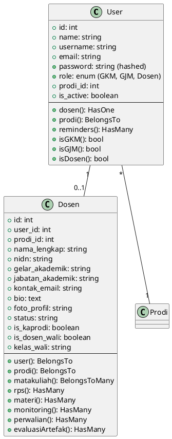

### 2. ACADEMIC STRUCTURE DOMAIN

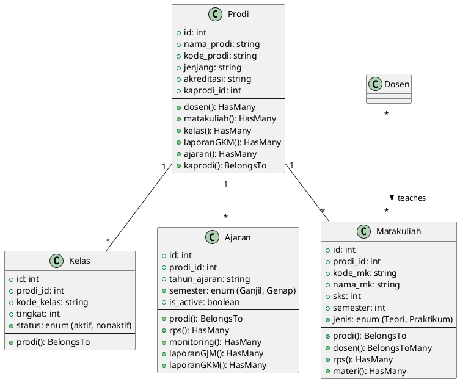

### 3. ACADEMIC CONTENT DOMAIN

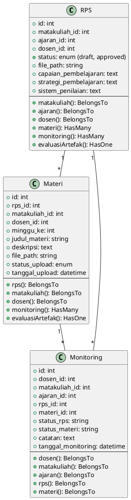

### 4. SURVEY & QUESTIONNAIRE DOMAIN

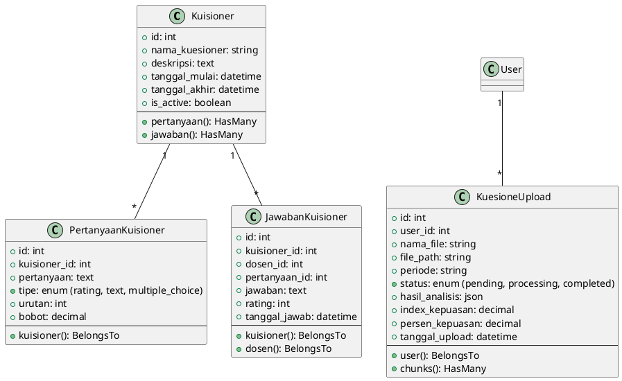

### 5. REPORT GENERATION DOMAIN

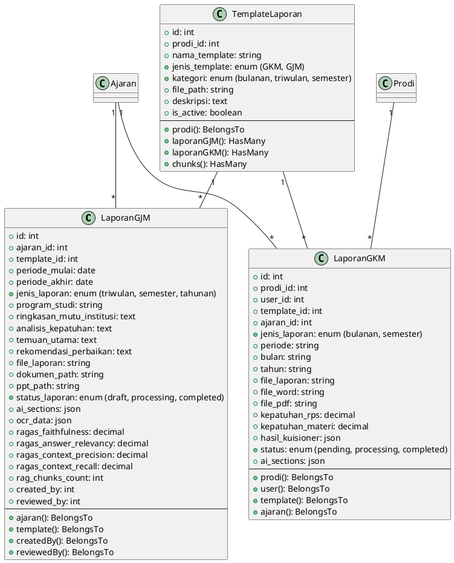

### 6. AI & RAG DOMAIN

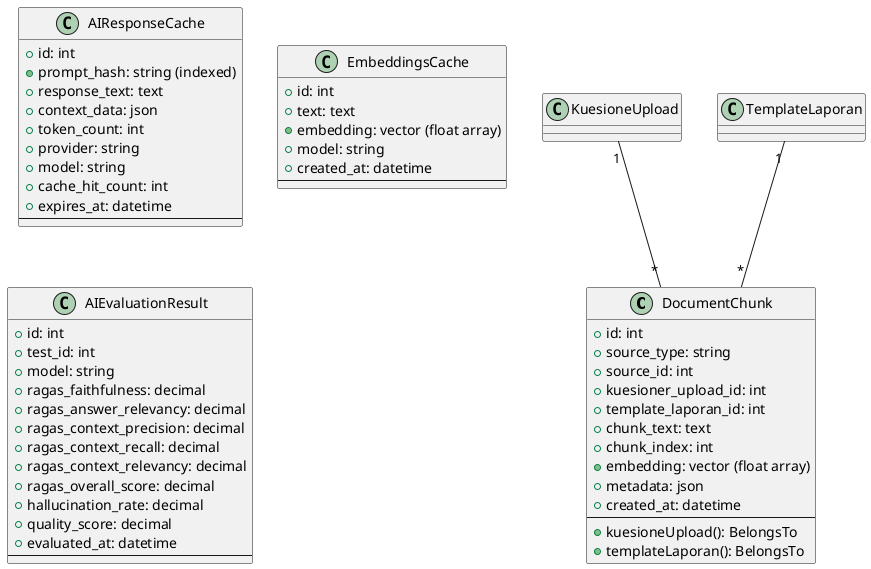

---

## SERVICE LAYER

### 1. AI SERVICES ARCHITECTURE

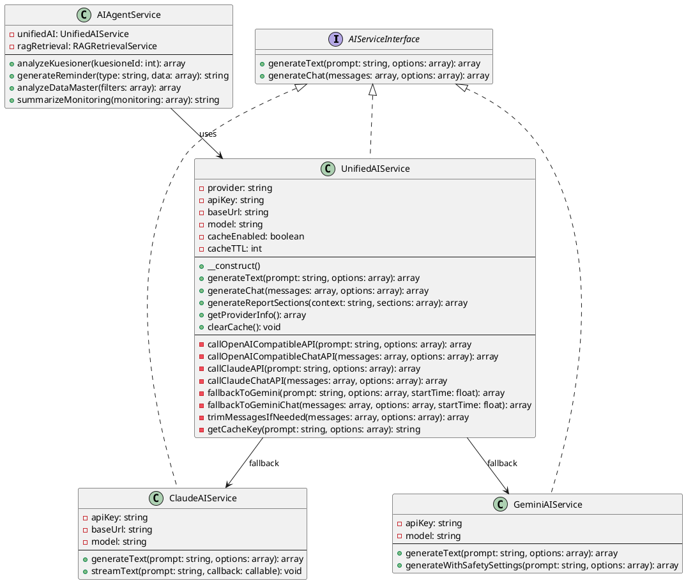

### 2. RAG SERVICES ARCHITECTURE

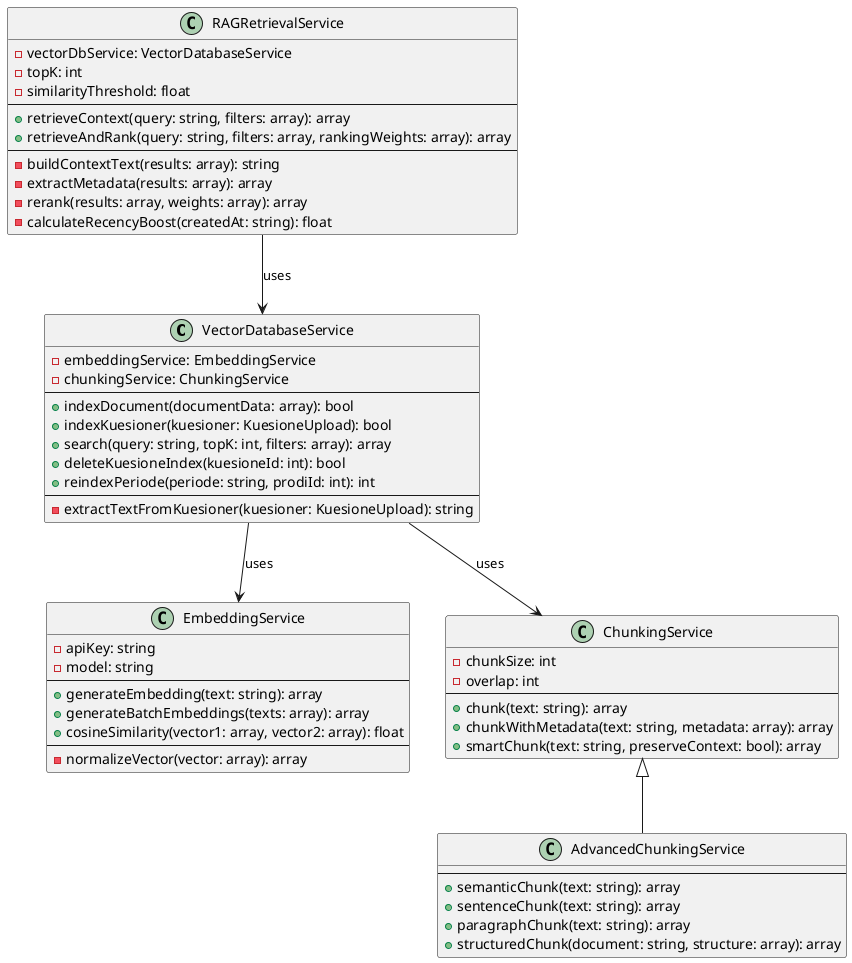

### 3. REPORT GENERATION SERVICES

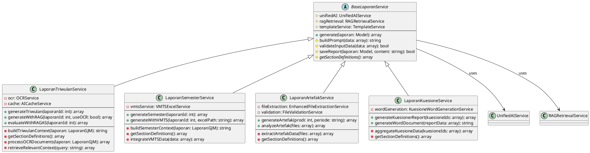

### 4. DOCUMENT PROCESSING SERVICES

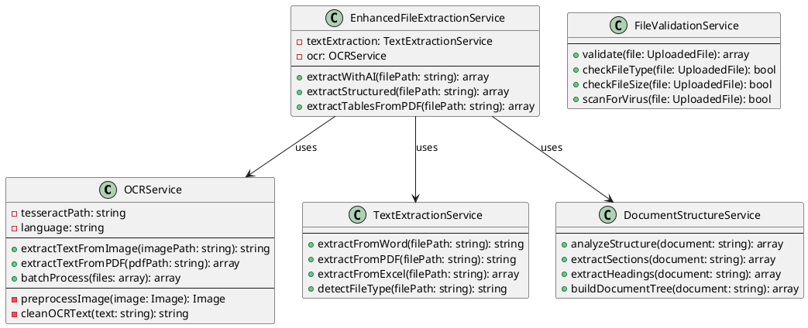

### 5. EVALUATION SERVICES

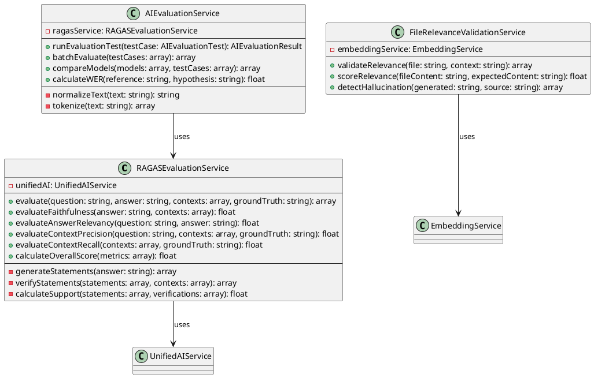

### 6. EXTERNAL API SERVICES

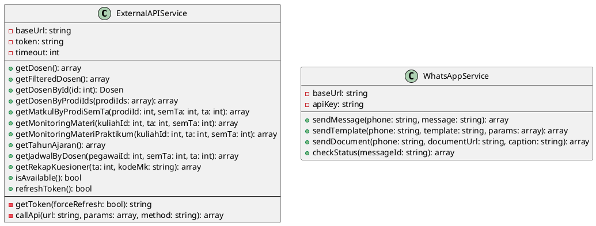

---

## CONTROLLER LAYER

### 1. GKM CONTROLLERS

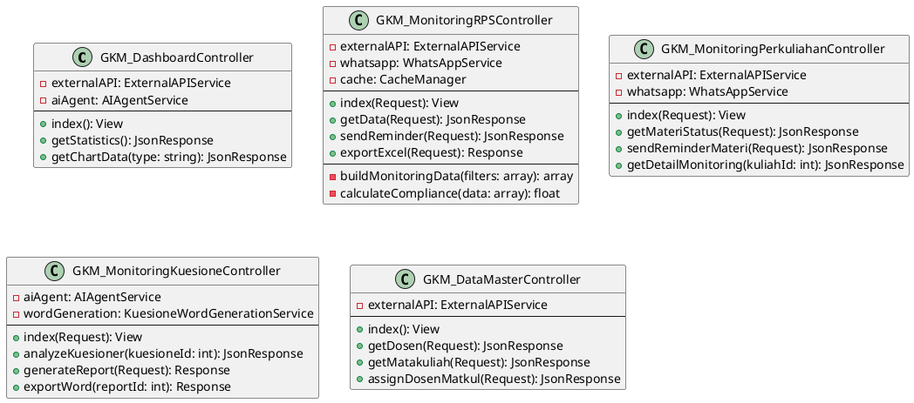

### 2. GJM CONTROLLERS

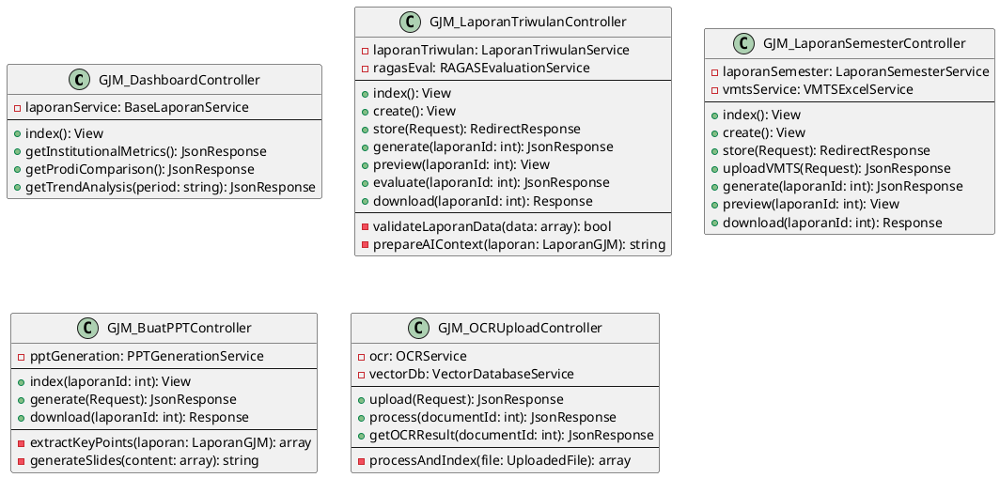

---

## BACKGROUND JOBS

### Job Architecture

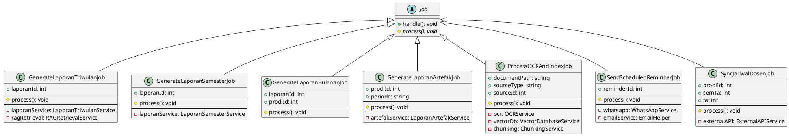

---

## EXTERNAL INTEGRATIONS

### Integration Architecture

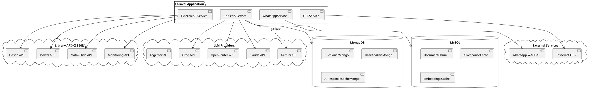

---

## DIAGRAM UML

### Complete System Class Diagram

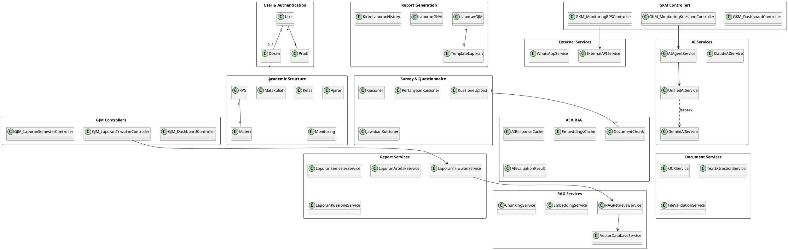

---

## DETAILED TECHNICAL SPECIFICATIONS

### 1. RAG (Retrieval Augmented Generation) Flow

```
┌─────────────────────────────────────────────────────────────┐
│  1. DOCUMENT INDEXING PHASE                                  │
├─────────────────────────────────────────────────────────────┤
│                                                               │
│  Document Upload                                             │
│       ↓                                                      │
│  Text Extraction (OCR/Parser)                               │
│       ↓                                                      │
│  Text Chunking (Semantic/Paragraph/Sentence)                │
│       ↓                                                      │
│  Generate Embeddings (Vector)                               │
│       ↓                                                      │
│  Store in DocumentChunk (MySQL with vector)                 │
│                                                               │
└─────────────────────────────────────────────────────────────┘

┌─────────────────────────────────────────────────────────────┐
│  2. RETRIEVAL PHASE                                          │
├─────────────────────────────────────────────────────────────┤
│                                                               │
│  User Query/Prompt                                           │
│       ↓                                                      │
│  Generate Query Embedding                                    │
│       ↓                                                      │
│  Vector Search (Cosine Similarity)                          │
│       ↓                                                      │
│  Rank by Similarity Score                                    │
│       ↓                                                      │
│  Filter by Threshold (0.3)                                   │
│       ↓                                                      │
│  Return Top K Results (10)                                   │
│                                                               │
└─────────────────────────────────────────────────────────────┘

┌─────────────────────────────────────────────────────────────┐
│  3. AUGMENTATION PHASE                                       │
├─────────────────────────────────────────────────────────────┤
│                                                               │
│  Retrieved Contexts                                          │
│       ↓                                                      │
│  Build Context Text                                          │
│       ↓                                                      │
│  Inject into AI Prompt                                       │
│       ↓                                                      │
│  Generate Response (LLM)                                     │
│       ↓                                                      │
│  Post-process & Format                                       │
│                                                               │
└─────────────────────────────────────────────────────────────┘

┌─────────────────────────────────────────────────────────────┐
│  4. EVALUATION PHASE (RAGAS)                                 │
├─────────────────────────────────────────────────────────────┤
│                                                               │
│  Generated Answer + Contexts + Ground Truth                  │
│       ↓                                                      │
│  Calculate Metrics:                                          │
│    - Faithfulness (no hallucination)                        │
│    - Answer Relevancy (matches question)                    │
│    - Context Precision (relevant contexts)                  │
│    - Context Recall (complete contexts)                     │
│       ↓                                                      │
│  Store in AIEvaluationResult                                │
│                                                               │
└─────────────────────────────────────────────────────────────┘
```

### 2. AI Provider Fallback Strategy

```
Primary Provider Selection (config: LLM_PROVIDER)
├── Groq (Free Tier)
│   └── Model: llama-3.3-70b-versatile
│   └── Context: 8K tokens
│
├── OpenRouter (Cheap)
│   └── Model: meta-llama/llama-3.1-70b-instruct
│   └── Context: 131K tokens
│
├── Together AI
│   └── Model: Meta-Llama-3.1-70B-Instruct-Turbo
│   └── Context: 131K tokens
│
└── Claude (Premium)
    └── Model: claude-3-5-sonnet/haiku
    └── Context: 200K tokens

                ↓ (on rate limit / 429 error)

Fallback Provider: Gemini
├── Model: gemini-1.5-flash
├── Context: 1M tokens
└── Triggered only on rate limit errors
```

### 3. Caching Strategy

```
┌─────────────────────────────────────────────────────────────┐
│  MULTI-TIER CACHING ARCHITECTURE                             │
├─────────────────────────────────────────────────────────────┤
│                                                               │
│  Level 1: Laravel Cache (Redis/Memcached)                   │
│  ├── TTL: 3500 seconds (API tokens)                         │
│  ├── TTL: 86400 seconds (AI responses)                      │
│  └── Key Format: unified_ai_{md5(prompt+options)}           │
│                                                               │
│  Level 2: MySQL (AIResponseCache)                           │
│  ├── Indexed by: prompt_hash                                │
│  ├── Stores: response_text, context_data, token_count      │
│  └── Tracks: cache_hit_count                                │
│                                                               │
│  Level 3: MongoDB (AIResponseCacheMongo)                    │
│  ├── For complex/nested data                                │
│  ├── Stores: full conversation history                      │
│  └── TTL: Configurable per collection                       │
│                                                               │
│  Level 4: EmbeddingsCache (MySQL)                           │
│  ├── Stores: text embeddings (vectors)                      │
│  ├── Indexed by: md5(text + model)                         │
│  └── Prevents redundant embedding generation                │
│                                                               │
└─────────────────────────────────────────────────────────────┘
```

### 4. Database Schema Overview

#### MySQL Tables

| Table Name | Purpose | Key Columns |
|------------|---------|-------------|
| `users` | User authentication | id, username, email, role, prodi_id |
| `dosen` | Lecturer profiles | id, user_id, prodi_id, nidn, jabatan_akademik |
| `prodi` | Program studi | id, nama_prodi, kode_prodi, kaprodi_id |
| `matakuliah` | Courses | id, prodi_id, kode_mk, nama_mk, sks |
| `rps` | Learning plans | id, matakuliah_id, ajaran_id, dosen_id, status |
| `materi` | Learning materials | id, rps_id, minggu_ke, status_upload |
| `monitoring` | Activity monitoring | id, dosen_id, matakuliah_id, status_rps |
| `kuisioner` | Surveys | id, nama_kuesioner, is_active |
| `kuesione_uploads` | Survey uploads | id, user_id, hasil_analisis, index_kepuasan |
| `laporan_gjm` | GJM reports | id, jenis_laporan, ai_sections, ragas_metrics |
| `laporan_gkm` | GKM reports | id, prodi_id, periode, ai_sections |
| `document_chunks` | Vector database | id, chunk_text, embedding, metadata |
| `ai_response_cache` | AI cache | id, prompt_hash, response_text, token_count |
| `embeddings_cache` | Vector cache | id, text, embedding, model |
| `ai_evaluation_results` | RAGAS metrics | id, ragas_faithfulness, ragas_overall_score |
| `template_laporan` | Report templates | id, prodi_id, jenis_template, file_path |
| `jadwal_reminders` | Scheduled reminders | id, type, schedule_time, status |

#### MongoDB Collections

| Collection Name | Purpose | Key Fields |
|-----------------|---------|------------|
| `kuesioner_mongo` | Raw survey data | kuesioner_id, raw_data, responses |
| `hasil_analisis_mongo` | Analysis results | kuesioner_id, detailed_analysis, statistics |
| `ai_response_cache_mongo` | AI conversation cache | prompt, response, conversation_history |

### 5. API Endpoints

#### Library API (CIS DEL)

```
Base URL: https://cis-dev.del.ac.id/api

Authentication:
POST /jwt-api/do-auth
  → Returns JWT token (valid ~1 hour)

Dosen Endpoints:
GET /library-api/dosen
  → Get all lecturers

GET /library-api/dosen/{id}
  → Get lecturer by ID

Jadwal Endpoints:
GET /library-api/get-jadwal-by-dosen
  params: pegawai_id, sem_ta, ta
  → Get lecturer schedule

Matakuliah Endpoints:
GET /library-api/matkul-by-prodi-sem-ta
  params: prodi_id, sem_ta, ta
  → Get courses by program, semester, year

Monitoring Endpoints:
GET /library-api/get-monitoring-materi-teori
  params: kuliah_id, ta, sem_ta
  → Get RPS and material upload status

GET /library-api/get-monitoring-materi-praktikum
  params: kuliah_id, ta, sem_ta
  → Get practicum material status

Tahun Ajaran Endpoints:
GET /library-api/tahun-ajaran
  → Get academic years

Kuesioner Endpoints:
GET /library-api/get-rekap-kuesioner
  params: ta, kode_mk
  → Get questionnaire summary
```

### 6. Key Design Patterns

#### 1. Service Layer Pattern
```php
// Controllers delegate business logic to Services
class MonitoringRPSController {
    private $externalAPI;
    private $whatsappService;
    
    public function sendReminder(Request $request) {
        // Validate
        $validated = $request->validate([...]);
        
        // Delegate to service
        $result = $this->whatsappService->sendReminder(
            $validated['phone'],
            $validated['message']
        );
        
        return response()->json($result);
    }
}
```

#### 2. Repository Pattern (Implicit via Eloquent)
```php
// Models act as repositories with query scopes
class Dosen extends Model {
    public function scopeKaprodi($query) {
        return $query->where('is_kaprodi', true);
    }
    
    public function scopeDosenWali($query) {
        return $query->where('is_dosen_wali', true);
    }
}

// Usage
$kaprodiList = Dosen::kaprodi()->get();
```

#### 3. Strategy Pattern (AI Provider Selection)
```php
class UnifiedAIService {
    public function generateText($prompt, $options) {
        return match($this->provider) {
            'claude' => $this->callClaudeAPI($prompt, $options),
            'groq' => $this->callOpenAICompatibleAPI($prompt, $options),
            'openrouter' => $this->callOpenAICompatibleAPI($prompt, $options),
            default => $this->callOpenAICompatibleAPI($prompt, $options)
        };
    }
}
```

#### 4. Observer Pattern (Eloquent Events)
```php
// Model events for automatic actions
class KuesioneUpload extends Model {
    protected static function booted() {
        static::created(function ($kuesioner) {
            // Dispatch job to process and index
            ProcessOCRAndIndexJob::dispatch($kuesioner);
        });
    }
}
```

#### 5. Factory Pattern (Job Creation)
```php
class ReportJobFactory {
    public static function create($type, $data) {
        return match($type) {
            'triwulan' => new GenerateLaporanTriwulanJob($data),
            'semester' => new GenerateLaporanSemesterJob($data),
            'bulanan' => new GenerateLaporanBulananJob($data),
            default => throw new \Exception("Unknown report type")
        };
    }
}
```

#### 6. Decorator Pattern (Enhanced Services)
```php
class EnhancedLaporanService extends BaseLaporanService {
    private $ragService;
    
    public function generate($laporan) {
        // Add RAG enhancement
        $contexts = $this->ragService->retrieveContext($laporan->prompt);
        
        // Call parent with enhanced context
        return parent::generate($laporan, $contexts);
    }
}
```

### 7. Security Considerations

#### Authentication & Authorization
```php
// Middleware: CheckRole
class CheckRole {
    public function handle($request, Closure $next, ...$roles) {
        if (!auth()->check()) {
            return redirect('login');
        }
        
        if (!in_array(auth()->user()->role, $roles)) {
            abort(403, 'Unauthorized');
        }
        
        return $next($request);
    }
}

// Route protection
Route::middleware(['auth', 'role:GKM'])->group(function () {
    Route::get('/gkm/dashboard', [GKM_DashboardController::class, 'index']);
});
```

#### Data Validation
```php
// Input sanitization
class FileValidationService {
    public function validate(UploadedFile $file): array {
        // Check MIME type
        $allowedTypes = ['application/pdf', 'application/vnd.openxmlformats-officedocument'];
        if (!in_array($file->getMimeType(), $allowedTypes)) {
            throw new ValidationException('Invalid file type');
        }
        
        // Check file size (max 10MB)
        if ($file->getSize() > 10 * 1024 * 1024) {
            throw new ValidationException('File too large');
        }
        
        return ['valid' => true];
    }
}
```

#### SQL Injection Prevention
```php
// Eloquent uses parameterized queries by default
Dosen::where('prodi_id', $prodiId)->get();
// Safe from SQL injection

// Raw queries with bindings
DB::select('SELECT * FROM dosen WHERE prodi_id = ?', [$prodiId]);
```

#### XSS Prevention
```php
// Blade templates auto-escape output
{{ $user->name }} // Escaped

// Raw output (use with caution)
{!! $trustedHtml !!}
```

#### API Token Security
```php
// Token caching with expiration
class APITokenManager {
    public function getToken($forceRefresh = false) {
        if ($forceRefresh) {
            Cache::forget('library_api_token');
        }
        
        return Cache::remember('library_api_token', 3500, function () {
            return $this->fetchNewToken();
        });
    }
}
```

#### Rate Limiting
```php
// API rate limiting
Route::middleware(['throttle:60,1'])->group(function () {
    // Max 60 requests per minute
});
```

### 8. Performance Optimization

#### Database Indexing
```sql
-- Indexes on frequently queried columns
CREATE INDEX idx_dosen_prodi ON dosen(prodi_id);
CREATE INDEX idx_rps_ajaran ON rps(ajaran_id, dosen_id);
CREATE INDEX idx_monitoring_status ON monitoring(status_rps, status_materi);
CREATE INDEX idx_document_chunks_source ON document_chunks(source_type, source_id);
CREATE INDEX idx_ai_cache_hash ON ai_response_cache(prompt_hash);

-- Full-text search index
CREATE FULLTEXT INDEX idx_laporan_content ON laporan_gjm(ringkasan_mutu_institusi);
```

#### Query Optimization
```php
// Eager loading to prevent N+1 queries
$dosen = Dosen::with(['prodi', 'matakuliah', 'rps'])->get();

// Chunking large datasets
Monitoring::chunk(100, function ($monitorings) {
    foreach ($monitorings as $monitoring) {
        // Process in batches
    }
});

// Select specific columns
Dosen::select('id', 'nama_lengkap', 'prodi_id')->get();
```

#### Caching Strategies
```php
// Cache monitoring data (expensive API calls)
$monitoring = Cache::remember(
    "monitoring_rps_{$prodiId}_{$semester}_{$tahun}", 
    3600, 
    function () use ($prodiId, $semester, $tahun) {
        return $this->externalAPI->getMonitoringData($prodiId, $semester, $tahun);
    }
);

// Cache dashboard statistics
$stats = Cache::tags(['dashboard', 'gjm'])
    ->remember('gjm_dashboard_stats', 1800, function () {
        return $this->calculateDashboardStats();
    });
```

#### Queue Management
```php
// Dispatch heavy jobs to queue
GenerateLaporanTriwulanJob::dispatch($laporanId)
    ->onQueue('reports')
    ->delay(now()->addSeconds(5));

// Chain jobs
GenerateLaporanTriwulanJob::withChain([
    new EvaluateWithRAGASJob($laporanId),
    new SendNotificationJob($laporanId)
])->dispatch($laporanId);
```

#### Asset Optimization
```javascript
// Lazy loading in frontend
document.addEventListener('DOMContentLoaded', function() {
    // Load heavy components only when needed
    if (document.querySelector('#monitoring-chart')) {
        import('./charts/monitoring-chart.js');
    }
});
```

### 9. Testing Strategy

#### Unit Tests
```php
// Service testing
class UnifiedAIServiceTest extends TestCase {
    public function test_generate_text_with_cache() {
        $service = new UnifiedAIService();
        
        $result = $service->generateText('Test prompt');
        
        $this->assertTrue($result['success']);
        $this->assertNotEmpty($result['text']);
    }
    
    public function test_fallback_to_gemini_on_rate_limit() {
        // Mock rate limit error
        Http::fake([
            'api.groq.com/*' => Http::response(null, 429)
        ]);
        
        $service = new UnifiedAIService();
        $result = $service->generateText('Test prompt');
        
        $this->assertStringContains('gemini', $result['provider']);
    }
}
```

#### Feature Tests
```php
class MonitoringRPSTest extends TestCase {
    public function test_gkm_can_view_monitoring_rps() {
        $user = User::factory()->create(['role' => 'GKM']);
        
        $response = $this->actingAs($user)
            ->get('/gkm/monitoring-rps');
        
        $response->assertStatus(200);
        $response->assertViewHas('monitoring');
    }
    
    public function test_dosen_cannot_access_gkm_monitoring() {
        $user = User::factory()->create(['role' => 'Dosen']);
        
        $response = $this->actingAs($user)
            ->get('/gkm/monitoring-rps');
        
        $response->assertStatus(403);
    }
}
```

#### Integration Tests
```php
class RAGWorkflowTest extends TestCase {
    public function test_complete_rag_workflow() {
        // 1. Index document
        $kuesioner = KuesioneUpload::factory()->create();
        $vectorDb = app(VectorDatabaseService::class);
        $indexed = $vectorDb->indexKuesioner($kuesioner);
        $this->assertTrue($indexed);
        
        // 2. Search
        $results = $vectorDb->search('kepuasan mahasiswa', 5);
        $this->assertNotEmpty($results);
        
        // 3. Generate report
        $ragService = app(RAGRetrievalService::class);
        $context = $ragService->retrieveContext('Analisis kepuasan');
        $this->assertArrayHasKey('context_text', $context);
    }
}
```

---

## DEPLOYMENT ARCHITECTURE

### Docker Infrastructure

```yaml
# docker-compose.yml structure
services:
  laravel:
    - PHP 8.2 FPM
    - Nginx
    - Supervisor (queue workers)
    - Ports: 8000
    
  nextjs:
    - Node.js 20
    - Next.js application
    - Ports: 3000
    
  python:
    - Python 3.11
    - Tesseract OCR
    - Flask API
    - Ports: 5000
    
  mysql:
    - MySQL 8.0
    - Persistent volume
    - Ports: 3306
    
  mongodb:
    - MongoDB 7.0
    - Persistent volume
    - Ports: 27017
    
  redis:
    - Redis 7.2
    - Cache & session storage
    - Ports: 6379
```

### Environment Configuration

```env
# Application
APP_NAME="GKM-GJM System"
APP_ENV=production
APP_DEBUG=false
APP_URL=https://your-domain.com

# Database
DB_CONNECTION=mysql
DB_HOST=mysql
DB_PORT=3306
DB_DATABASE=gkm_gjm
DB_USERNAME=root
DB_PASSWORD=secret

# MongoDB
MONGODB_URI=mongodb://mongodb:27017/gkm_gjm

# LLM Configuration
LLM_ENABLED=true
LLM_PROVIDER=groq
LLM_API_KEY=your-groq-api-key
LLM_MODEL=llama-3.3-70b-versatile

# Claude Fallback
ANTHROPIC_API_KEY=your-claude-key
ANTHROPIC_MODEL=claude-3-5-sonnet-20241022

# External APIs
LIBRARY_API_URL=https://cis-dev.del.ac.id/api
LIBRARY_API_USERNAME=your-username
LIBRARY_API_PASSWORD=your-password

# WhatsApp
WHATSAPP_API_URL=https://wachat-api.com
WHATSAPP_API_KEY=your-whatsapp-key

# Queue
QUEUE_CONNECTION=redis
```

---

## FUTURE ENHANCEMENTS

### Planned Features

#### 1. Advanced Analytics Dashboard
- Real-time data visualization with Apache Spark
- Predictive analytics for academic trends
- Machine learning models for early warning system

#### 2. Multi-language Support
- i18n implementation for Indonesian and English
- Automatic translation using AI
- Localized report templates

#### 3. Mobile Application
- React Native mobile app
- Push notifications for reminders
- Offline mode with sync

#### 4. Advanced RAG Features
- Multi-modal RAG (text + images + tables)
- Hybrid search (keyword + semantic)
- Graph-based knowledge representation

#### 5. Enhanced AI Capabilities
- Fine-tuned models for academic domain
- Custom LLM training on institutional data
- Multi-agent orchestration

#### 6. Integration Expansion
- Microsoft Teams integration
- Slack notifications
- Google Workspace integration
- Email automation enhancement

#### 7. Blockchain for Report Verification
- Immutable audit trail
- Document authenticity verification
- Timestamping with blockchain

---

## GLOSSARY

| Term | Definition |
|------|------------|
| **GKM** | Gugus Kendali Mutu - Program-level quality assurance |
| **GJM** | Gugus Jaminan Mutu - Institutional-level quality assurance |
| **RAG** | Retrieval Augmented Generation - AI technique for context-aware generation |
| **RAGAS** | RAG Assessment Score - Metrics for evaluating RAG systems |
| **RPS** | Rencana Pembelajaran Semester - Semester learning plan |
| **Prodi** | Program Studi - Academic program |
| **Dosen** | Lecturer/Professor |
| **Matakuliah** | Course/Subject |
| **OCR** | Optical Character Recognition |
| **Vector Database** | Database for storing and querying embeddings |
| **Embedding** | Numerical vector representation of text |
| **Cosine Similarity** | Metric for measuring similarity between vectors |
| **LLM** | Large Language Model |

---

## REFERENCES

### Technologies Used

#### Backend Framework
- **Laravel 11** - PHP web framework
- **PHP 8.2+** - Programming language

#### Frontend
- **Blade Templates** - Laravel templating engine
- **Alpine.js** - Lightweight JavaScript framework
- **Tailwind CSS** - Utility-first CSS framework

#### Databases
- **MySQL 8.0** - Relational database
- **MongoDB 7.0** - NoSQL document database
- **Redis 7.2** - In-memory data structure store

#### AI & ML
- **Groq** - Fast inference for LLMs
- **Claude (Anthropic)** - Advanced language model
- **Gemini (Google)** - Multimodal AI model
- **OpenRouter** - Unified LLM API
- **Together AI** - Open-source model hosting

#### Document Processing
- **Tesseract OCR** - Optical character recognition
- **PhpSpreadsheet** - Excel file processing
- **PhpWord** - Word document generation
- **TCPDF** - PDF generation

#### External Integrations
- **Library API (CIS DEL)** - Academic data provider
- **WACHAT** - WhatsApp business API

#### DevOps
- **Docker** - Containerization
- **Docker Compose** - Multi-container orchestration
- **Nginx** - Web server
- **Supervisor** - Process manager

### Academic References

1. **RAG Implementation**
   - Lewis, P., et al. (2020). "Retrieval-Augmented Generation for Knowledge-Intensive NLP Tasks"
   
2. **RAGAS Metrics**
   - Es, S., et al. (2023). "RAGAS: Automated Evaluation of Retrieval Augmented Generation"
   
3. **Vector Databases**
   - Johnson, J., et al. (2019). "Billion-scale similarity search with GPUs"
   
4. **Educational Quality Assurance**
   - SPMI (Sistem Penjaminan Mutu Internal) Guidelines 2024
   - BAN-PT Accreditation Standards 9.0

---

## CONTACT & SUPPORT

**Kelompok:** 06  
**Mata Kuliah:** Proyek Akhir 3  
**Institusi:** Institut Teknologi Del  
**Tahun:** 2026  

**Repository:** [GitHub Repository URL]  
**Documentation:** [Documentation URL]  
**Issue Tracker:** [Issue Tracker URL]  

---

## CHANGELOG

### Version 1.0 (15 Juni 2026)
- Initial documentation release
- Complete class diagram coverage
- Comprehensive architecture documentation
- RAG & RAGAS implementation details
- Multi-provider AI integration
- External API documentation

---

**End of Documentation**
