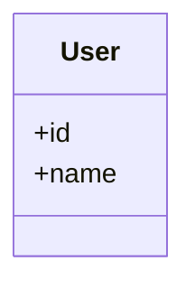

# 🔍 CLASS DIAGRAM TOOLS - DETAILED COMPARISON

**Panduan Memilih Tools Terbaik untuk Kebutuhan Anda**

---

## 📊 QUICK COMPARISON

| Tool | Price | Platform | Automation | Quality | Use Case |
|------|-------|----------|------------|---------|----------|
| **Our Script** | 🆓 Free | CLI | ⭐⭐⭐⭐⭐ | ⭐⭐⭐⭐ | Daily dev |
| **PlantUML** | 🆓 Free | Cross | ⭐⭐⭐⭐⭐ | ⭐⭐⭐⭐⭐ | Documentation |
| **Mermaid** | 🆓 Free | Web | ⭐⭐⭐⭐ | ⭐⭐⭐⭐ | GitHub docs |
| **Draw.io** | 🆓 Free | Web/Desktop | ⭐⭐ | ⭐⭐⭐⭐⭐ | Presentations |
| **Visual Paradigm** | 💰 $99+ | Desktop | ⭐⭐⭐⭐⭐ | ⭐⭐⭐⭐⭐ | Professional |
| **StarUML** | 💰 $69 | Desktop | ⭐⭐⭐⭐ | ⭐⭐⭐⭐⭐ | Academic |
| **Lucidchart** | 💰 $7.95/mo | Web | ⭐⭐⭐ | ⭐⭐⭐⭐⭐ | Collaboration |

---

## 🆓 FREE TOOLS (RECOMMENDED)

### 1. Our Custom Script + PlantUML

**🏆 BEST FOR:** Daily development & technical documentation

#### Pros
- ✅ 100% automated
- ✅ Free & open source
- ✅ Works offline
- ✅ Git-friendly (text format)
- ✅ High quality exports
- ✅ Industry standard

#### Cons
- ❌ Need Java for image generation
- ❌ Learning curve for PlantUML syntax
- ❌ Limited styling options

#### Setup
```bash
# 1. Generate diagram
php scripts/generate-class-diagram.php --models-only

# 2. Install PlantUML
choco install plantuml  # Windows
brew install plantuml    # Mac

# 3. Generate image
plantuml -tsvg docs/diagrams/class-diagram.puml
```

#### Best Workflow
```
Code → Script → PlantUML → SVG → Documentation
```

---

### 2. Mermaid Live

**🏆 BEST FOR:** GitHub/GitLab documentation

#### Pros
- ✅ Native GitHub support
- ✅ No installation needed
- ✅ Simple syntax
- ✅ Real-time preview
- ✅ Free forever

#### Cons
- ❌ Limited customization
- ❌ Simpler than PlantUML
- ❌ Online only

#### Setup
```bash
# Generate Mermaid format
php scripts/generate-class-diagram.php --full --format=mermaid
```

#### Usage in GitHub
```markdown
# In your README.md


```

GitHub auto-renders it! ✨

---

### 3. Draw.io (Diagrams.net)

**🏆 BEST FOR:** Presentations & manual refinement

#### Pros
- ✅ Beautiful output
- ✅ Drag & drop interface
- ✅ Many templates
- ✅ Export to many formats
- ✅ Cloud storage integration

#### Cons
- ❌ Mostly manual
- ❌ Not automated from code
- ❌ Time-consuming

#### When to Use
- Final presentation slides
- Thesis/paper diagrams
- Marketing materials
- Client presentations

#### Workflow
```
Our Script (JSON) → Import → Manual Layout → Export PNG/PDF
```

---

## 💰 PAID TOOLS (PROFESSIONAL)

### 1. Visual Paradigm

**Price:** $99 - $699 (perpetual license)

**🏆 BEST FOR:** Enterprise & complete UML suite

#### Features
- ✅ Reverse engineering from code
- ✅ Database ERD generation
- ✅ Team collaboration
- ✅ All UML diagram types
- ✅ Requirements management
- ✅ Agile tools

#### Reverse Engineering PHP
```
1. Tools → Code → Instant Reverse
2. Select Laravel app/ folder
3. Auto-generate diagrams
4. Customize & export
```

#### When Worth It
- Working in large team
- Need complete UML suite
- Professional deliverables
- Client presentations

---

### 2. StarUML

**Price:** $69 (single license)

**🏆 BEST FOR:** Academic work & thesis

#### Features
- ✅ Affordable
- ✅ Clean interface
- ✅ PHP extension
- ✅ Multiple exports
- ✅ Extension system

#### PHP Extension
Install from: Tools → Extension Manager → PHP

#### Setup
```
1. File → Import → PHP
2. Select app/ folder
3. Configure import settings
4. Generate diagrams
```

#### Why for Academic
- Professional look
- UML 2.5 standard
- Clean exports
- Affordable for students

---

### 3. Lucidchart

**Price:** $7.95/mo per user

**🏆 BEST FOR:** Team collaboration

#### Features
- ✅ Real-time collaboration
- ✅ Cloud-based
- ✅ Many integrations
- ✅ Comments & reviews
- ✅ Version history

#### Integrations
- Google Workspace
- Microsoft Office
- Slack
- Jira

#### When to Use
- Remote team
- Need feedback from non-technical
- Collaborative design sessions

---

## 🎯 RECOMMENDATION BY USE CASE

### Use Case 1: Daily Development

**Tools:** Our Script + VSCode PlantUML Extension

**Why:**
- Fast & automated
- Works offline
- Git-friendly
- No cost

**Workflow:**
```bash
# 1. After code changes
php scripts/generate-class-diagram.php --models-only

# 2. Preview in VSCode
# (PlantUML extension auto-preview)

# 3. Commit diagram source
git add docs/diagrams/*.puml
git commit -m "docs: update models diagram"
```

---

### Use Case 2: GitHub Documentation

**Tools:** Our Script (Mermaid) + GitHub

**Why:**
- Native GitHub rendering
- No build step needed
- Always up-to-date

**Workflow:**
```bash
# Generate Mermaid
php scripts/generate-class-diagram.php --models-only --format=mermaid

# Embed in README.md
```

```markdown
## Architecture

```mermaid
[auto-generated content here]
```
```

---

### Use Case 3: Thesis/Academic Paper

**Tools:** StarUML or Visual Paradigm

**Why:**
- Professional quality
- UML standard compliant
- High-resolution exports
- Customizable styling

**Workflow:**
```
1. Generate with StarUML reverse engineering
2. Manually refine layout
3. Apply thesis template style
4. Export PDF 300 DPI
```

---

### Use Case 4: Client Presentation

**Tools:** Draw.io or Visual Paradigm

**Why:**
- Beautiful visuals
- Flexible styling
- Animation support (Draw.io)
- Multiple export formats

**Workflow:**
```
1. Start with auto-generated (our script)
2. Import to Draw.io
3. Manual beautification
4. Export PNG/PDF
```

---

### Use Case 5: Team Collaboration

**Tools:** Lucidchart or Visual Paradigm

**Why:**
- Real-time collaboration
- Comments & feedback
- Version control
- Integrations

**Workflow:**
```
1. Generate base diagram
2. Import to Lucidchart
3. Team review & refine
4. Export final version
```

---

## 🚀 RECOMMENDED SETUP

### For Individual Developer

```bash
# FREE Setup
1. Our script (generation)
2. VSCode + PlantUML extension (viewing)
3. PlantUML CLI (export)
4. GitHub (hosting)

Total cost: $0
```

### For Small Team (2-5 people)

```bash
# FREE Setup
1. Our script (generation)
2. GitHub (version control + viewing)
3. PlantUML Online (sharing)
4. Draw.io (presentations)

Total cost: $0
```

### For Professional Team

```bash
# PAID Setup
Option A: Visual Paradigm Team License
- Cost: ~$299/year per user
- Best for: Large projects

Option B: Lucidchart + Our Script
- Cost: $7.95/mo per user
- Best for: Collaboration

Option C: StarUML + Our Script
- Cost: $69 one-time per user
- Best for: Budget-conscious
```

---

## 📈 QUALITY COMPARISON

### Export Quality

#### Our Script → PlantUML → SVG
- Resolution: ✅ Infinite (vector)
- File size: ✅ Small
- Quality: ⭐⭐⭐⭐⭐

#### Mermaid → PNG
- Resolution: ⭐⭐⭐⭐ (configurable)
- File size: ⭐⭐⭐
- Quality: ⭐⭐⭐⭐

#### Visual Paradigm → PDF
- Resolution: ✅ Customizable (up to 600 DPI)
- File size: ⭐⭐⭐
- Quality: ⭐⭐⭐⭐⭐

#### Draw.io → PNG
- Resolution: ✅ Customizable
- File size: ⭐⭐⭐
- Quality: ⭐⭐⭐⭐⭐

### Recommendation for Print
```
Visual Paradigm → PDF 300 DPI
or
PlantUML → SVG → PDF (Inkscape)
```

---

## 🎨 STYLING COMPARISON

### PlantUML
```plantuml
skinparam class {
    BackgroundColor<<Model>> LightBlue
    BorderColor Black
}
```
**Customization:** ⭐⭐⭐ (text-based)

### Mermaid
```mermaid
%%{init: {'theme':'base'}}%%
```
**Customization:** ⭐⭐ (limited themes)

### Draw.io
**Customization:** ⭐⭐⭐⭐⭐ (full WYSIWYG)

### Visual Paradigm
**Customization:** ⭐⭐⭐⭐⭐ (professional templates)

---

## 💡 PRO TIPS

### Tip 1: Hybrid Approach
```
Generate with script → Refine in Draw.io → Present
```

### Tip 2: CI/CD Integration
```yaml
# Auto-generate on every commit
- name: Generate Diagram
  run: php scripts/generate-class-diagram.php --full
```

### Tip 3: Multiple Formats
```bash
# Generate all formats
php scripts/generate-class-diagram.php --full --format=plantuml
php scripts/generate-class-diagram.php --full --format=mermaid
php scripts/generate-class-diagram.php --full --format=json
```

### Tip 4: Version Control
```bash
# Track both source and image
git add docs/diagrams/*.puml
git add docs/diagrams/*.svg
```

---

## 📝 FINAL VERDICT

### Best Overall: **PlantUML + Our Script**
- Free
- Automated
- High quality
- Git-friendly

### Best for Beginners: **Mermaid + GitHub**
- No installation
- Simple syntax
- Auto-rendering

### Best for Professional: **Visual Paradigm**
- Complete UML suite
- Team features
- Enterprise ready

### Best for Presentation: **Draw.io**
- Beautiful output
- Flexible
- Easy to use

---

**Choose based on your needs, not trends! 🎯**
