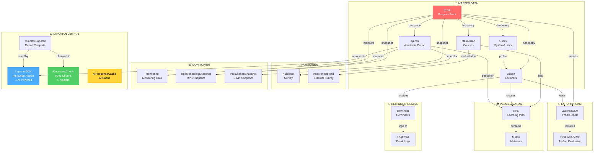
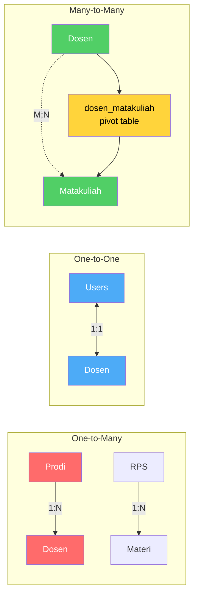
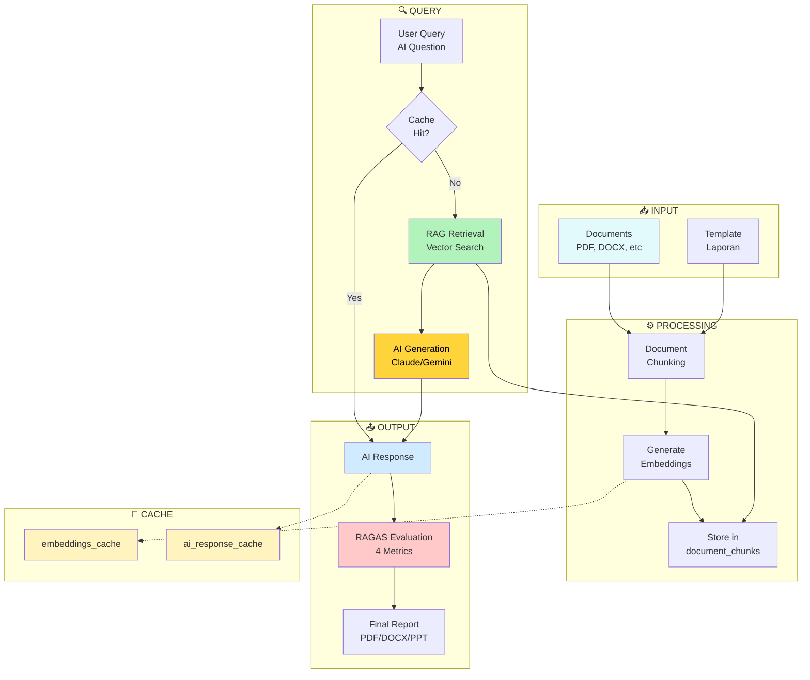
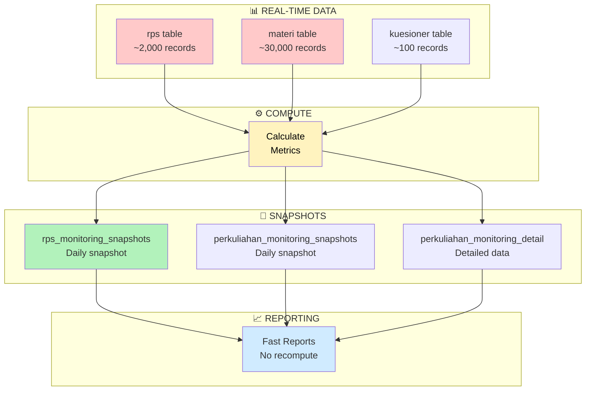
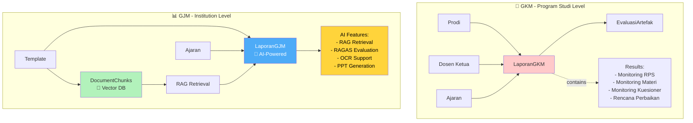
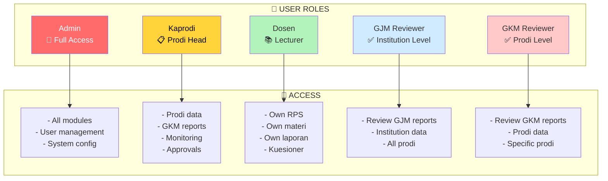
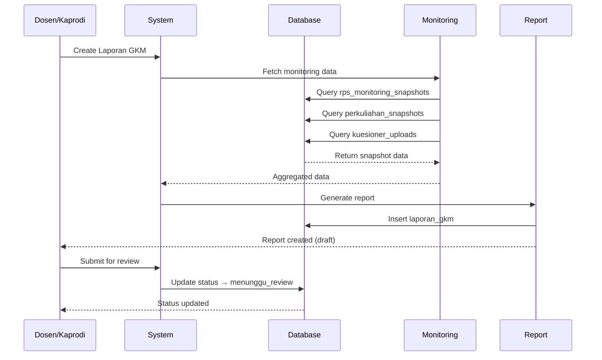
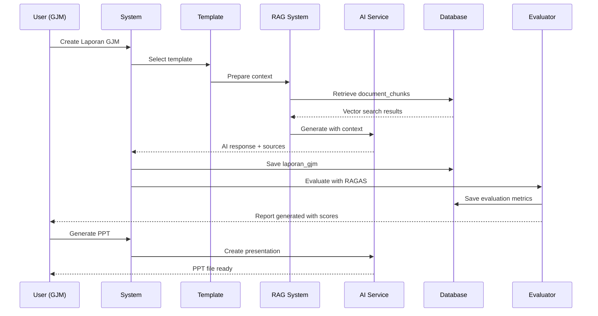
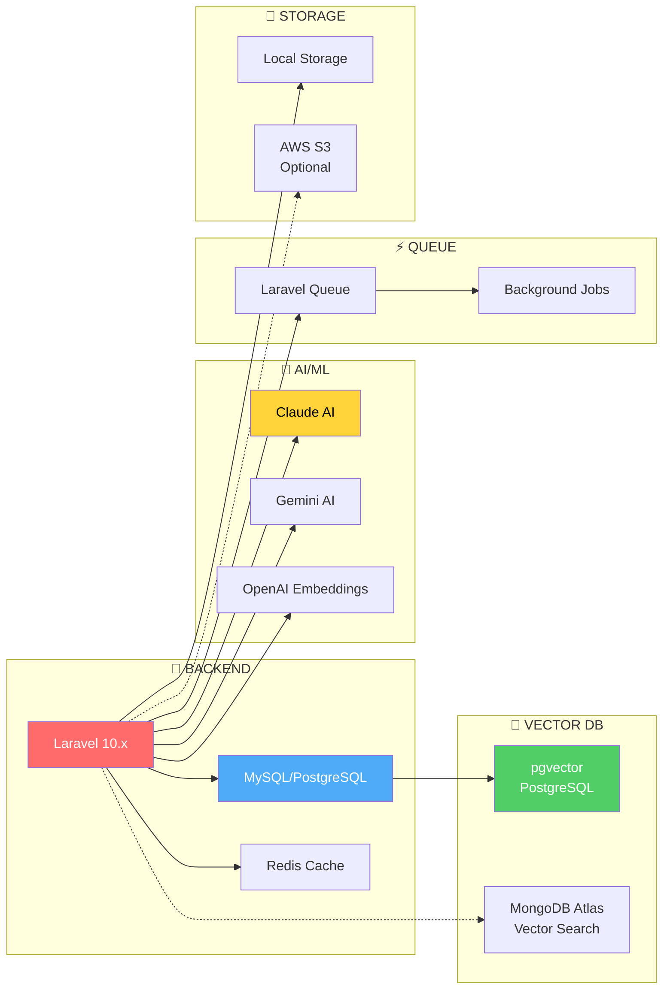
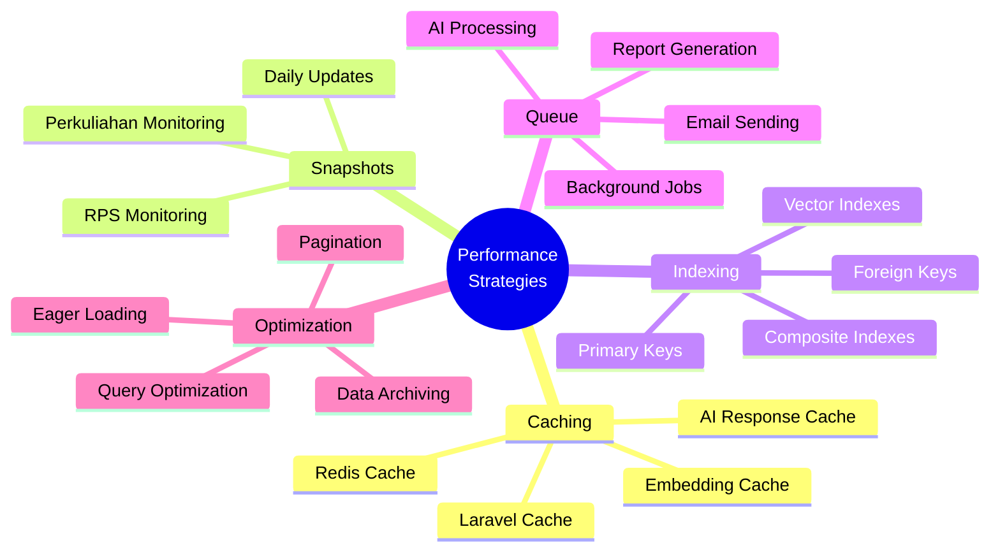

# 📊 ERD Visual Overview

## Database Structure at a Glance

### Core Entity Groups

## Relationship Types

## AI & RAG System Flow

## Monitoring & Snapshot Pattern

## Laporan GKM vs GJM

## User Roles & Access

## Data Flow: Creating GKM Report

## Data Flow: Creating GJM Report with AI

## Technology Stack

## Performance Optimizations

## Summary Statistics

| Category | Count | Notes |
|----------|-------|-------|
| **Total Tables** | 43 | Including system tables |
| **Master Data** | 9 | Core entities |
| **Application** | 22 | Business logic |
| **AI/RAG** | 4 | AI system |
| **System** | 3 | Laravel system |
| **Relations** | 5 | Pivot/junction tables |
| **Foreign Keys** | 100+ | Relationships |
| **Indexes** | 50+ | Performance |
| **JSON Fields** | 15+ | Flexible data |
| **Vector Fields** | 2 | Embeddings |

## File Reference

| File | Purpose | View |
|------|---------|------|
| `ERD_DATABASE.puml` | Complete ERD (43 tables) | PlantUML |
| `ERD_SIMPLIFIED.puml` | Simplified overview | PlantUML |
| `ERD_DOCUMENTATION.md` | Full documentation | Markdown |
| `ERD_README.md` | Detailed guide | Markdown |
| `ERD_OVERVIEW.md` | This file (visual) | Mermaid |

## Quick Links

- 🌐 [View PlantUML Online](https://www.planttext.com/)
- 🌐 [View Mermaid Online](https://mermaid.live/)
- 📖 [Quick Guide](../ERD_QUICK_GUIDE.md)
- 📘 [Full Documentation](./ERD_DOCUMENTATION.md)

---

**Last Updated:** 2026-06-16  
**Format:** Mermaid (GitHub-native rendering)  
**Status:** ✅ Complete
