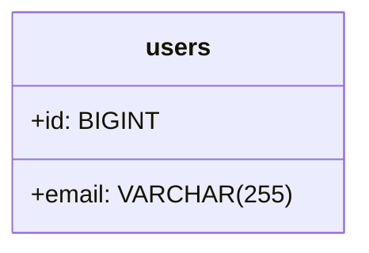
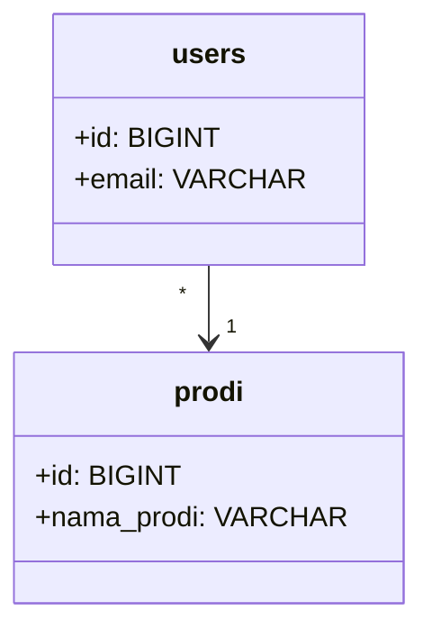
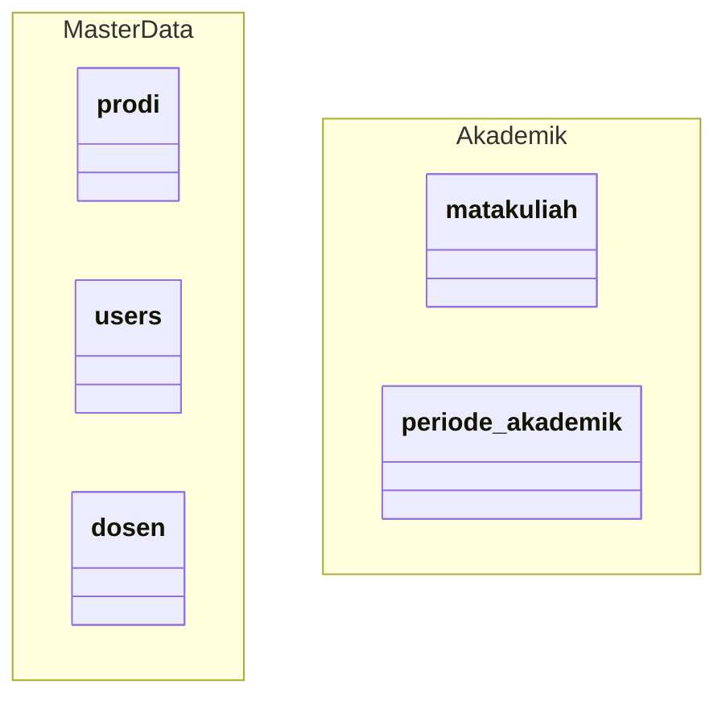
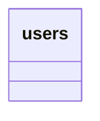

# 🐠 Mermaid Class Diagram - Panduan Penggunaan

## 📁 File yang Tersedia

### 1. **CLASS_DIAGRAM_MERMAID.mmd** (Lengkap)
- ✅ Semua atribut lengkap dengan tipe data
- ✅ Semua method dengan return type
- ✅ Notes/keterangan untuk setiap domain
- ✅ Dokumentasi lengkap
- ⚠️ File besar, mungkin lambat di-render

### 2. **CLASS_DIAGRAM_MERMAID_CLEAN.mmd** (Ringkas) ⭐ Recommended
- ✅ Lebih ringkas dan cepat di-render
- ✅ Fokus pada struktur utama
- ✅ Cocok untuk presentasi
- ✅ Kompatibel dengan semua Mermaid renderer

---

## 🚀 Cara Melihat Diagram

### Option 1: Mermaid Live Editor (Online) ⭐ Termudah

1. Buka: https://mermaid.live/
2. Copy isi file `.mmd`
3. Paste di editor sebelah kiri
4. Diagram otomatis muncul di kanan
5. Klik **"Actions"** → **"Download PNG/SVG"**

### Option 2: VS Code Extension

```bash
# Install extension
ext install bierner.markdown-mermaid

# Cara pakai:
# 1. Buat file .md
# 2. Sisipkan kode mermaid di dalam triple backticks
# 3. Preview dengan Ctrl+Shift+V
```

**Contoh di Markdown:**
````markdown

````

### Option 3: GitHub/GitLab (Auto-render)

Mermaid otomatis di-render di GitHub dan GitLab. Cukup:
1. Commit file `.md` dengan kode mermaid
2. View di GitHub/GitLab
3. Diagram langsung muncul

### Option 4: Mermaid CLI

```bash
# Install
npm install -g @mermaid-js/mermaid-cli

# Generate PNG
mmdc -i CLASS_DIAGRAM_MERMAID_CLEAN.mmd -o diagram.png

# Generate SVG (scalable)
mmdc -i CLASS_DIAGRAM_MERMAID_CLEAN.mmd -o diagram.svg

# Generate PDF
mmdc -i CLASS_DIAGRAM_MERMAID_CLEAN.mmd -o diagram.pdf

# Dengan background putih
mmdc -i CLASS_DIAGRAM_MERMAID_CLEAN.mmd -o diagram.png -b white

# High resolution
mmdc -i CLASS_DIAGRAM_MERMAID_CLEAN.mmd -o diagram.png -w 3000 -H 2000
```

---

## 🎨 Kustomisasi Tema

### Tema Bawaan Mermaid:

Tambahkan di awal file `.mmd`:

```mermaid
%%{init: {'theme':'default'}}%%
classDiagram
    ...
```

**Tema yang tersedia:**
- `default` - Tema standar
- `forest` - Hijau natural
- `dark` - Dark mode
- `neutral` - Abu-abu minimalis
- `base` - Basic clean

### Custom Styling:

```mermaid
%%{init: {
    'theme':'base',
    'themeVariables': {
        'primaryColor':'#E3F2FD',
        'primaryTextColor':'#000',
        'primaryBorderColor':'#1976D2',
        'lineColor':'#424242',
        'secondaryColor':'#FFF3E0',
        'tertiaryColor':'#E8F5E9'
    }
}}%%
classDiagram
    ...
```

---

## 📊 Perbedaan Mermaid vs PlantUML

| Aspek | Mermaid | PlantUML |
|-------|---------|----------|
| **Rendering** | Browser-based | Java-based |
| **Setup** | Tidak perlu install | Perlu Java + Graphviz |
| **GitHub Support** | ✅ Native | ❌ Perlu extension |
| **Online Editor** | ✅ Gratis | ✅ Gratis |
| **Syntax** | Lebih simple | Lebih powerful |
| **Customization** | Limited | Extensive |
| **Performance** | Cepat | Lambat untuk file besar |
| **Export Quality** | Good | Excellent |

---

## 🎯 Kapan Pakai Mermaid?

### ✅ Gunakan Mermaid untuk:
- Dokumentasi di GitHub/GitLab
- README.md yang butuh diagram
- Presentasi quick & simple
- Collaborative editing online
- Diagram yang sering diupdate
- Integrasi dengan Markdown

### ❌ Gunakan PlantUML untuk:
- Diagram sangat kompleks
- Butuh customization detail
- Export quality tinggi untuk print
- Standar enterprise documentation
- Control penuh atas layout

---

## 💡 Tips & Tricks

### 1. Embed di Markdown untuk GitHub

```markdown
# Class Diagram


```

### 2. Relasi Opsional dengan Dotted Line

```mermaid
reminder "*" ..> "0..1" dosen : tentang (opsional)
```

### 3. Method Visibility

```mermaid
class users {
    +publicMethod()
    -privateMethod()
    #protectedMethod()
    ~packageMethod()
}
```

### 4. Abstract Class

```mermaid
class BaseModel {
    <<abstract>>
    +save()
    +delete()
}
```

### 5. Interface

```mermaid
class Authenticatable {
    <<interface>>
    +authenticate()
}
```

### 6. Namespace/Package



---

## 🔧 Troubleshooting

### Diagram tidak muncul?
- ✅ Cek syntax error (titik koma, kurung)
- ✅ Pastikan indentasi konsisten
- ✅ Gunakan versi CLEAN untuk debugging

### Diagram terpotong?
- ✅ Export dengan width/height lebih besar
- ✅ Gunakan SVG untuk scalable
- ✅ Pecah diagram jadi beberapa bagian

### Garis relasi berantakan?
- ✅ Mermaid auto-layout, tidak bisa dikontrol manual
- ✅ Urutkan class definition lebih logis
- ✅ Gunakan PlantUML jika butuh control penuh

### Emoji tidak muncul?
- ✅ Mermaid tidak support emoji
- ✅ Gunakan text biasa: `BelongsTo` bukan `BelongsTo`

---

## 📱 Integrasi dengan Tools Lain

### Notion
1. Copy kode mermaid
2. Paste di Notion
3. Pilih "Create embed" → Mermaid

### Confluence
1. Install "Mermaid Diagrams" plugin
2. Insert macro: `/mermaid`
3. Paste kode

### Obsidian
```markdown

```

### Jupyter Notebook
```python
from IPython.display import HTML
HTML('<script src="https://cdn.jsdelivr.net/npm/mermaid/dist/mermaid.min.js"></script>')
```

---

## 🎓 Learning Resources

### Official Documentation:
- https://mermaid.js.org/syntax/classDiagram.html

### Interactive Tutorial:
- https://mermaid.live/

### Cheat Sheet:
- https://jojozhuang.github.io/tutorial/mermaid-cheat-sheet/

### Examples:
- https://github.com/mermaid-js/mermaid/tree/develop/demos

---

## 📦 Struktur File

```
docs/diagrams/
├── CLASS_DIAGRAM_MERMAID.mmd              🆕 (Lengkap)
├── CLASS_DIAGRAM_MERMAID_CLEAN.mmd        🆕 (Ringkas)
├── MERMAID_USAGE_GUIDE.md                 🆕 (Panduan ini)
├── CLASS_DIAGRAM_FROM_SQL_INDONESIA.puml  (PlantUML)
├── CLASS_DIAGRAM_INDONESIA_SIMPLE.puml    (PlantUML)
└── ...
```

---

## 🚀 Quick Start Commands

```bash
# 1. View online (termudah)
start https://mermaid.live/

# 2. Install CLI
npm install -g @mermaid-js/mermaid-cli

# 3. Export PNG
mmdc -i CLASS_DIAGRAM_MERMAID_CLEAN.mmd -o diagram.png -b white

# 4. Export SVG (recommended untuk dokumen)
mmdc -i CLASS_DIAGRAM_MERMAID_CLEAN.mmd -o diagram.svg

# 5. Export dengan ukuran custom
mmdc -i CLASS_DIAGRAM_MERMAID_CLEAN.mmd -o diagram.png -w 2400 -H 1800
```

---

## 🎯 Rekomendasi

| Kebutuhan | File | Export Format |
|-----------|------|---------------|
| GitHub README | `CLEAN.mmd` | Langsung embed |
| PowerPoint | `CLEAN.mmd` | PNG (white bg) |
| Word Document | `CLEAN.mmd` | SVG |
| Print (Poster) | `MERMAID.mmd` | PNG (high-res) |
| Quick Review | `CLEAN.mmd` | Mermaid Live |
| Documentation | `MERMAID.mmd` | SVG |

---

## ✨ Keunggulan Versi Mermaid

1. ✅ **GitHub Native** - Auto-render tanpa extension
2. ✅ **No Installation** - Bisa pakai online editor
3. ✅ **Fast Rendering** - Lebih cepat dari PlantUML
4. ✅ **Simple Syntax** - Mudah dipahami dan diedit
5. ✅ **Markdown Friendly** - Perfect untuk documentation
6. ✅ **Collaborative** - Easy to share dan edit bersama
7. ✅ **Modern** - Active development dan community

---

**Created**: 2026-06-16  
**Format**: Mermaid Class Diagram  
**Versions**: 2 (Full + Clean)  
**Total Classes**: 13  
**Total Relations**: 36
