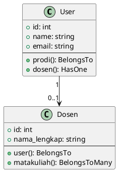
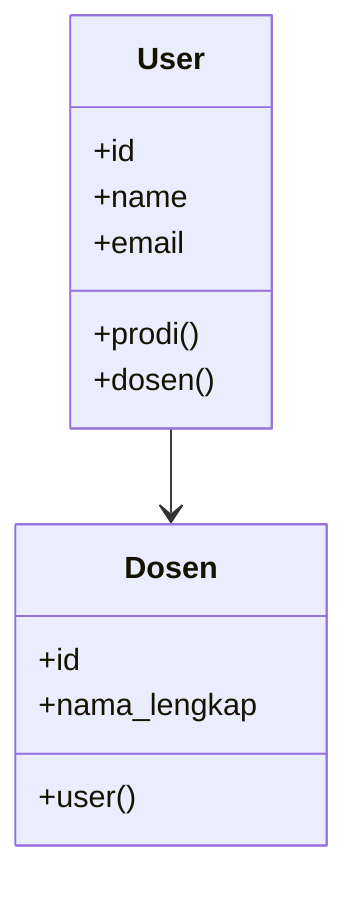

# 🚀 Class Diagram Generator Script

Auto-generate UML Class Diagrams dari Laravel codebase.

---

## � Features

- ✅ **Auto-scan** Laravel Models, Services, Controllers
- ✅ **Extract relationships** (belongsTo, hasMany, etc.)
- ✅ **Parse dependencies** (constructor injection)
- ✅ **Multiple formats**: PlantUML, Mermaid, JSON
- ✅ **Selective generation**: Models-only, Services-only, etc.
- ✅ **Zero dependencies**: Pure PHP script

---

## 🎯 Quick Start

### Generate Complete Diagram

```bash
php scripts/generate-class-diagram.php --full
```

Output: `docs/diagrams/class-diagram.plantuml`

### Generate Models Only

```bash
php scripts/generate-class-diagram.php --models-only
```

### Generate with Mermaid Format

```bash
php scripts/generate-class-diagram.php --full --format=mermaid
```

---

## 📖 Usage

```bash
php scripts/generate-class-diagram.php [OPTIONS]
```

### Options

| Option | Description | Example |
|--------|-------------|---------|
| `--format=<type>` | Output format: `plantuml`, `mermaid`, `json` | `--format=plantuml` |
| `--output=<path>` | Custom output path | `--output=my-diagram.puml` |
| `--models-only` | Generate Models only | |
| `--services-only` | Generate Services only | |
| `--controllers-only` | Generate Controllers only | |
| `--full` | Generate complete diagram | |

### Examples

```bash
# 1. Generate Models in PlantUML format
php scripts/generate-class-diagram.php --models-only --format=plantuml

# 2. Generate Services in Mermaid format
php scripts/generate-class-diagram.php --services-only --format=mermaid

# 3. Generate complete in JSON (for processing)
php scripts/generate-class-diagram.php --full --format=json --output=data.json

# 4. Generate Models to specific location
php scripts/generate-class-diagram.php --models-only --output=docs/models-diagram.puml
```

---

## 📊 Output Formats

### 1. PlantUML (`.puml`)

**Best for:** Documentation, presentations, high-quality exports



**View online:** https://www.plantuml.com/plantuml/uml/

### 2. Mermaid (`.mmd`)

**Best for:** GitHub documentation, markdown files



**Native support:** GitHub, GitLab, Notion

### 3. JSON (`.json`)

**Best for:** Further processing, custom tools

```json
{
  "User": {
    "type": "model",
    "fillable": ["name", "email", "role"],
    "relationships": [
      {"type": "belongsTo", "related": "Prodi"},
      {"type": "hasOne", "related": "Dosen"}
    ]
  }
}
```

---

## 🎨 Viewing & Converting Diagrams

### Online Viewers

#### PlantUML Online
1. Go to https://www.plantuml.com/plantuml/uml/
2. Paste your `.puml` content
3. Download PNG/SVG/PDF

#### Mermaid Live
1. Go to https://mermaid.live/
2. Paste your `.mmd` content
3. Download PNG/SVG

### VSCode Extensions

Install extensions:
```bash
# PlantUML
code --install-extension jebbs.plantuml

# Mermaid Preview
code --install-extension vstirbu.vscode-mermaid-preview
```

Then:
- Open `.puml` or `.mmd` file
- Press `Alt + D` to preview

### Command Line (PlantUML)

```bash
# Install PlantUML (requires Java)
# Windows: choco install plantuml
# Mac: brew install plantuml
# Linux: apt install plantuml

# Generate PNG
plantuml docs/diagrams/class-diagram.puml

# Generate SVG (recommended)
plantuml -tsvg docs/diagrams/class-diagram.puml

# Generate PDF (for documentation)
plantuml -tpdf docs/diagrams/class-diagram.puml
```

---

## 🔧 Integration with CI/CD

### GitHub Actions

Create `.github/workflows/generate-diagrams.yml`:

```yaml
name: Generate Class Diagrams

on:
  push:
    branches: [main]
    paths:
      - 'app/Models/**'
      - 'app/Services/**'
      - 'app/Http/Controllers/**'

jobs:
  generate:
    runs-on: ubuntu-latest
    steps:
      - uses: actions/checkout@v3
      
      - name: Setup PHP
        uses: shivammathur/setup-php@v2
        with:
          php-version: '8.2'
      
      - name: Generate Diagram
        run: php scripts/generate-class-diagram.php --full --format=mermaid
      
      - name: Commit & Push
        run: |
          git config user.name github-actions
          git config user.email github-actions@github.com
          git add docs/diagrams/
          git commit -m "chore: update class diagram" || echo "No changes"
          git push
```

---

## � What Gets Extracted

### From Models

- ✅ Fillable fields
- ✅ Casts
- ✅ Eloquent relationships (belongsTo, hasMany, etc.)
- ✅ Scopes
- ✅ Accessors & Mutators
- ✅ Model events

### From Services

- ✅ Public methods
- ✅ Protected methods
- ✅ Constructor dependencies
- ✅ Private properties

### From Controllers

- ✅ Public methods (routes)
- ✅ Constructor dependencies
- ✅ Middleware

---

## 🎯 Best Practices

### 1. Regular Generation

Generate diagrams after major changes:
```bash
# After adding new Models
php scripts/generate-class-diagram.php --models-only

# Commit to repo
git add docs/diagrams/
git commit -m "docs: update models diagram"
```

### 2. Multiple Diagrams

Don't put everything in one diagram:
```bash
# Separate diagrams for clarity
php scripts/generate-class-diagram.php --models-only --output=docs/diagrams/models.puml
php scripts/generate-class-diagram.php --services-only --output=docs/diagrams/services.puml
php scripts/generate-class-diagram.php --controllers-only --output=docs/diagrams/controllers.puml
```

### 3. Documentation

Include in your README:
```markdown
## Architecture

### Domain Models


### Service Layer

```

---

## 🐛 Troubleshooting

### "Class not found"

Make sure you're running from project root:
```bash
cd /path/to/PA3-KEL06-2026
php scripts/generate-class-diagram.php --full
```

### "Memory exhausted"

Increase PHP memory limit:
```bash
php -d memory_limit=512M scripts/generate-class-diagram.php --full
```

### Empty diagram

Check file permissions:
```bash
chmod +x scripts/generate-class-diagram.php
```

---

## 🆕 Extending the Script

### Add Custom Parsers

Edit `generate-class-diagram.php`:

```php
// Add new parser
public function generateRepositories()
{
    $repoPath = $this->basePath . '/app/Repositories';
    // ... implementation
}
```

### Custom Output Format

```php
public function generateCustomFormat($data)
{
    // Your custom format logic
    return $formatted;
}
```

---

## 📚 Further Reading

- [PlantUML Documentation](https://plantuml.com/)
- [Mermaid Documentation](https://mermaid-js.github.io/)
- [UML Class Diagrams](https://www.uml-diagrams.org/class-diagrams-overview.html)
- [Laravel Architecture Best Practices](https://laravel.com/docs/master/structure)

---

## 🤝 Contributing

Found a bug or want to add a feature?

1. Fork the repo
2. Create feature branch
3. Make your changes
4. Submit PR

---

## 📄 License

MIT License - Feel free to use in your projects!

---

**Made with ❤️ for Laravel Developers**
